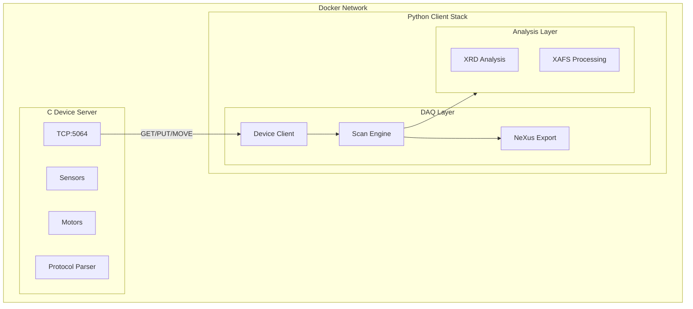
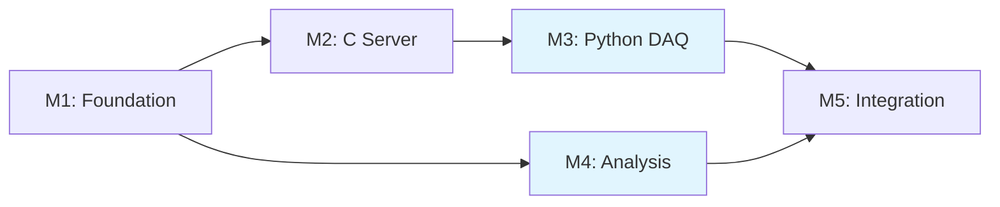

# Beamline Simulator - Detailed Implementation Plan

## Project Architecture



## Dependency Graph



**Parallel Development:** M3 (DAQ) and M4 (Analysis) can be developed independently of each other.

---

## Milestone 1: Foundation

Project infrastructure and tooling setup.

### 1.1 Project Structure

- `device/` directory: `meson.build`, `src/`, `include/`, `tests/`
- `python/beamline/` package: `daq/`, `analysis/`
- `docker/`, `examples/`, `docs/` directories

### 1.2 C Tooling

- [device/meson.build](device/meson.build) - Meson build configuration
- [device/.clang-format](device/.clang-format) - LLVM style base
- [device/.clang-tidy](device/.clang-tidy) - Static analysis rules

### 1.3 Python Tooling

- [python/pyproject.toml](python/pyproject.toml) - Already exists, will be extended
- [python/.pre-commit-config.yaml](python/.pre-commit-config.yaml)

### 1.4 CI/CD Skeleton

- [.github/workflows/ci.yml](.github/workflows/ci.yml)

---

## Milestone 2: C Device Server

### Phase 2.1: Core Server

| File | Responsibility |

|------|----------------|

| `main.c` | Entry point, signal handling (SIGINT/SIGTERM) |

| `server.c/h` | TCP socket, bind, listen, accept |

| `protocol.c/h` | Command parsing, response formatting |

| `devices.c/h` | Device registry, sensor simulation |

| `utils.c/h` | Logging (syslog), error handling |

| `config.h` | Port, buffer sizes, PV limits |

**Protocol - Basic Commands:**

```
GET:BL02:RING:CURRENT   -> OK:350.5
PUT:BL02:MONO:ENERGY:7112  -> OK:PUT
PING                     -> OK:PONG
QUIT                     -> OK:BYE
```

**Simulated Sensors (Read-only):**

- `BL02:RING:CURRENT` - Ring current (0-400 mA, with noise)
- `BL02:VACUUM:PRESSURE` - Vacuum level (1e-10 to 1e-8 mbar)
- `BL02:HUTCH:TEMP` - Temperature (20-26°C, with drift)

### Phase 2.2: Multi-Client & Motors

**select() Multiplexing:**

```c
fd_set read_fds;
int max_fd;
struct client clients[MAX_CLIENTS];

while (running) {
    select(max_fd + 1, &read_fds, NULL, NULL, &timeout);
    // Handle new connections and client data
}
```

**Motor Simulation:**

- Acceleration/velocity/deceleration profile
- Asynchronous MOVE command (non-blocking)
- STATUS polling (IDLE/MOVING)
- Position readback (.RBV suffix)

**Additional Commands:**

```
MOVE:BL02:SAMPLE:X:1000   -> OK:MOVING
STATUS:BL02:SAMPLE:X      -> OK:IDLE or OK:MOVING
LIST:BL02:*               -> OK:BL02:RING:CURRENT,BL02:MONO:ENERGY,...
MONITOR:BL02:DET:I0:100   -> DATA:12345 (every 100ms)
STOP                      -> OK:STOPPED
```

### Phase 2.3: Test & Quality

- CMocka unit tests: `test_protocol.c`, `test_devices.c`
- Valgrind memory leak check
- ASan build via Meson option

---

## Milestone 3: Python DAQ Layer

### 3.1 Device Client ([python/beamline/daq/client.py](python/beamline/daq/client.py))

```python
class DeviceClient:
    def __init__(self, host: str, port: int = 5064) -> None: ...
    def get(self, pv: str) -> float: ...
    def put(self, pv: str, value: float) -> None: ...
    def move(self, motor: str, position: float, wait: bool = True) -> None: ...
    def status(self, motor: str) -> MotorStatus: ...
```

### 3.2 Device Abstractions ([python/beamline/daq/device.py](python/beamline/daq/device.py))

```python
class Motor(BaseModel):
    pv: str
    client: DeviceClient

    def move_to(self, position: float, wait: bool = True) -> None: ...
    def position(self) -> float: ...  # reads .RBV

class Detector(BaseModel):
    pv: str
    client: DeviceClient

    def read(self) -> float: ...
```

### 3.3 Scan Engine ([python/beamline/daq/scan.py](python/beamline/daq/scan.py))

**Pydantic Models:**

```python
class ScanRegion(BaseModel):
    start: float
    stop: float
    step: float

class LinearScanConfig(BaseModel):
    motor: str
    start: float
    stop: float
    steps: int
    detectors: list[str]
    dwell_time: float = 0.1  # seconds
```

**Scan Types:**

- `LinearScan` - 1D motor sweep
- `MeshScan` - 2D grid scan
- `XAFSScan` - Variable step regions (pre-edge, edge, EXAFS)

### 3.4 Data Export

**ScanData Container:**

```python
@dataclass
class ScanData:
    motor_positions: dict[str, np.ndarray]
    detector_readings: dict[str, np.ndarray]
    timestamps: np.ndarray
    metadata: dict[str, Any]

    def to_csv(self, path: Path) -> None: ...
    def to_nexus(self, path: Path) -> None: ...
```

---

## Milestone 4: Analysis Module

### 4.1 XRD Analysis ([python/beamline/analysis/xrd.py](python/beamline/analysis/xrd.py))

**Peak Finding:**

```python
def find_peaks(
    two_theta: np.ndarray,
    intensity: np.ndarray,
    prominence: float = 0.1
) -> list[Peak]:
    # Uses scipy.signal.find_peaks
```

**Peak Fitting:**

```python
def fit_peak(
    two_theta: np.ndarray,
    intensity: np.ndarray,
    center: float,
    model: Literal["gaussian", "lorentzian", "voigt"] = "gaussian"
) -> FitResult:
    # Uses scipy.optimize.curve_fit
```

**Physical Calculations:**

- `calculate_d_spacing(two_theta, wavelength)` - Bragg's Law: `d = λ / (2 sin θ)`
- `estimate_crystallite_size(fwhm, two_theta)` - Scherrer: `D = Kλ / (β cos θ)`

### 4.2 XAFS Processing ([python/beamline/analysis/xafs.py](python/beamline/analysis/xafs.py))

**Edge Finding:**

```python
def find_edge(energy: np.ndarray, mu: np.ndarray) -> float:
    # First derivative maximum
    deriv = np.gradient(mu, energy)
    return energy[np.argmax(deriv)]
```

**Normalization:**

```python
def normalize(
    energy: np.ndarray,
    mu: np.ndarray,
    e0: float,
    pre_edge: tuple[float, float] = (-150, -30),
    post_edge: tuple[float, float] = (50, 300)
) -> np.ndarray:
    # Pre-edge baseline subtraction
    # Post-edge normalization
```

**Chi(k) Extraction:**

```python
def extract_chi(
    energy: np.ndarray,
    mu_norm: np.ndarray,
    e0: float,
    rbkg: float = 1.0
) -> tuple[np.ndarray, np.ndarray]:
    # E -> k conversion: k = sqrt(2m(E-E0)/hbar^2)
    # Background spline subtraction
    return k, chi_k
```

**Fourier Transform:**

```python
def fourier_transform(
    k: np.ndarray,
    chi: np.ndarray,
    kmin: float = 2.0,
    kmax: float = 12.0,
    kweight: int = 2,
    window: str = "hanning"
) -> tuple[np.ndarray, np.ndarray]:
    return r, chi_r_magnitude
```

---

## Milestone 5: Integration & Polish

### 5.1 NeXus/HDF5 Export ([python/beamline/daq/nexus.py](python/beamline/daq/nexus.py))

**NXxas Schema:**

```
/entry (NXentry)
  /title
  /start_time
  /instrument (NXinstrument)
    /source (NXsource)
      /current
    /monochromator (NXmonochromator)
      /energy
    /detector (NXdetector)
      /data
  /sample (NXsample)
    /name
    /position_x, /position_y
  /data (NXdata) @signal="intensity" @axes="energy"
```

### 5.2 Docker Deployment

**[docker/Dockerfile.device](docker/Dockerfile.device):**

```dockerfile
# Build stage
FROM alpine:3.21 AS builder
RUN apk add --no-cache gcc musl-dev meson ninja
COPY device/ /app/
WORKDIR /app
RUN meson setup build --buildtype=release && meson compile -C build

# Runtime stage
FROM alpine:3.21
COPY --from=builder /app/build/beamline-sim /usr/local/bin/
EXPOSE 5064
CMD ["beamline-sim"]
```

**[docker/Dockerfile.python](docker/Dockerfile.python):**

```dockerfile
FROM python:3.14-alpine
RUN pip install uv
COPY python/ /app/
WORKDIR /app
RUN uv sync
```

**[docker/docker-compose.yml](docker/docker-compose.yml):**

```yaml
services:
  device-server:
    build:
      context: ..
      dockerfile: docker/Dockerfile.device
    ports:
      - "5064:5064"
    networks:
      - beamline

  python-client:
    build:
      context: ..
      dockerfile: docker/Dockerfile.python
    depends_on:
      - device-server
    networks:
      - beamline
    environment:
      - DEVICE_HOST=device-server

networks:
  beamline:
```

### 5.3 CI/CD Pipeline

**[.github/workflows/ci.yml](.github/workflows/ci.yml):**

```yaml
jobs:
  c-build:
    runs-on: ubuntu-latest
    steps:
      - uses: actions/checkout@v4
      - name: Install deps
        run: sudo apt-get install -y meson ninja-build cmocka
      - name: Build & Test
        run: |
          cd device
          meson setup build
          meson compile -C build
          meson test -C build

  python-lint-test:
    runs-on: ubuntu-latest
    steps:
      - uses: actions/checkout@v4
      - uses: astral-sh/setup-uv@v4
      - name: Install & Lint
        run: |
          cd python
          uv sync --dev
          uv run ruff check .
          uv run mypy beamline
      - name: Test
        run: |
          cd python
          uv run pytest --cov=beamline --cov-report=xml
```

### 5.4 Examples & Documentation

**Example Scripts:**

- `examples/01_basic_usage.py` - Connection, GET/PUT
- `examples/02_linear_scan.py` - Simple motor scan
- `examples/03_xafs_scan.py` - Fe K-edge XAFS
- `examples/04_xrd_analysis.ipynb` - Peak fitting demo
- `examples/05_xafs_analysis.ipynb` - Full XAFS workflow

**Documentation:**

- `README.md` - Quick start, installation
- `docs/PROTOCOL.md` - Command reference
- `docs/ARCHITECTURE.md` - System design
- `docs/ANALYSIS.md` - Scientific methods

---

## Success Criteria

**C Server:**

- 10+ concurrent client support
- Valgrind clean (no memory leaks)
- `-Wall -Wextra -Wpedantic -Werror` clean
- clang-tidy and cppcheck pass

**Python:**

- mypy strict mode pass
- ruff lint + format pass
- 80%+ test coverage
- Hypothesis property tests for numerical functions

**Integration:**

- Single command deployment with Docker Compose
- NeXus files pass NXxas schema validation
- Setup in under 10 minutes with README
