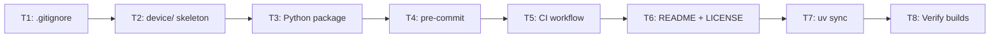

# M1 Foundation - Detailed Implementation Plan

## Overview

This milestone establishes the complete project infrastructure:

- Directory structure for C device server and Python packages
- Build system configuration (Meson for C, uv for Python)
- Code quality tooling (clang-format, clang-tidy, ruff, mypy)
- CI/CD pipeline (GitHub Actions)
- Pre-commit hooks for automated quality checks

## Current State

```
beamline-simulator/
├── .cursor/          # Cursor rules (keep)
├── .git/             # Git repo (keep)
├── .gitignore        # Empty (needs content)
├── project-prd.md    # PRD document (keep)
└── python/
    └── pyproject.toml  # Already configured (may need minor updates)
```

## Target State

```
beamline-simulator/
├── .github/
│   └── workflows/
│       └── ci.yml
├── .gitignore
├── .pre-commit-config.yaml
├── LICENSE
├── README.md
├── device/
│   ├── .clang-format
│   ├── .clang-tidy
│   ├── meson.build
│   ├── include/
│   │   └── config.h
│   ├── src/
│   │   └── main.c
│   └── tests/
│       └── .gitkeep
├── docker/
│   └── .gitkeep
├── docs/
│   └── .gitkeep
├── examples/
│   └── .gitkeep
└── python/
    ├── .python-version
    ├── pyproject.toml
    ├── beamline/
    │   ├── __init__.py
    │   ├── daq/
    │   │   └── __init__.py
    │   └── analysis/
    │       └── __init__.py
    └── tests/
        └── __init__.py
```

---

## Task 1: Create .gitignore

Comprehensive gitignore for Python, C, and build artifacts.

```gitignore
# Python
__pycache__/
*.py[cod]
*$py.class
*.so
.Python
build/
develop-eggs/
dist/
downloads/
eggs/
.eggs/
lib/
lib64/
parts/
sdist/
var/
wheels/
*.egg-info/
.installed.cfg
*.egg
.venv/
venv/
ENV/

# uv
.uv/

# Testing
.pytest_cache/
.coverage
htmlcov/
.hypothesis/

# Type checking
.mypy_cache/

# C/Meson
builddir/
build/
*.o
*.a
*.so
*.dylib

# IDE
.idea/
.vscode/
*.swp
*.swo
*~

# OS
.DS_Store
Thumbs.db

# Project specific
*.nxs
*.h5
*.hdf5
```

---

## Task 2: Device Directory Structure

### 2.1 device/meson.build

```meson
project(
    'beamline-sim',
    'c',
    version: '0.1.0',
    license: 'MIT',
    default_options: [
        'c_std=c23',
        'warning_level=3',
        'werror=true',
        'b_sanitize=address,undefined',
    ],
)

# Source files (to be populated in M2)
src_files = files(
    'src/main.c',
)

# Include directories
inc_dirs = include_directories('include')

# Main executable
executable(
    'beamline-sim',
    src_files,
    include_directories: inc_dirs,
    install: true,
)

# Tests (to be populated in M2)
# cmocka_dep = dependency('cmocka', required: false)
# if cmocka_dep.found()
#     subdir('tests')
# endif
```

### 2.2 device/.clang-format

```yaml
---
BasedOnStyle: LLVM
Language: Cpp
IndentWidth: 4
ColumnLimit: 100
BreakBeforeBraces: Attach
AllowShortFunctionsOnASingleLine: Empty
AllowShortIfStatementsOnASingleLine: Never
AllowShortLoopsOnASingleLine: false
AlignConsecutiveMacros: true
AlignConsecutiveDeclarations: false
AlignTrailingComments: true
SpaceAfterCStyleCast: true
PointerAlignment: Right
```

### 2.3 device/.clang-tidy

```yaml
---
Checks: >
  bugprone-*,
  clang-analyzer-*,
  performance-*,
  readability-*,
  -readability-identifier-length,
  -readability-magic-numbers

WarningsAsErrors: "*"

HeaderFilterRegex: "device/(src|include)/.*"

CheckOptions:
  - key: readability-function-cognitive-complexity.Threshold
    value: 25
```

### 2.4 device/include/config.h

```c
#ifndef BEAMLINE_CONFIG_H
#define BEAMLINE_CONFIG_H

// Network configuration
#define BEAMLINE_PORT 5064
#define BEAMLINE_BACKLOG 10
#define BEAMLINE_MAX_CLIENTS 32

// Buffer sizes
#define BEAMLINE_CMD_BUFFER_SIZE 1024
#define BEAMLINE_RESPONSE_BUFFER_SIZE 4096

// PV limits
#define BEAMLINE_MAX_PVS 128
#define BEAMLINE_PV_NAME_MAX 64

// Timing
#define BEAMLINE_SELECT_TIMEOUT_MS 100
#define BEAMLINE_MOTOR_UPDATE_INTERVAL_MS 10

#endif // BEAMLINE_CONFIG_H
```

### 2.5 device/src/main.c

```c
#include <stdio.h>
#include <stdlib.h>

#include "config.h"

int main(void) {
    printf("Beamline Device Simulator v0.1.0\n");
    printf("Port: %d\n", BEAMLINE_PORT);
    printf("Max clients: %d\n", BEAMLINE_MAX_CLIENTS);

    // TODO: Initialize server (M2)
    // TODO: Start event loop (M2)

    return EXIT_SUCCESS;
}
```

---

## Task 3: Python Package Structure

### 3.1 python/.python-version

```
3.14
```

### 3.2 python/beamline/**init**.py

```python
"""Beamline simulator package for synchrotron data acquisition and analysis."""

__version__ = "0.1.0"
__all__ = ["daq", "analysis"]
```

### 3.3 python/beamline/daq/**init**.py

```python
"""Data acquisition module for beamline control."""

__all__: list[str] = []

# Exports will be added in M3:
# - DeviceClient
# - Motor, Detector, Shutter
# - LinearScan, MeshScan, XAFSScan
# - NeXusWriter
```

### 3.4 python/beamline/analysis/**init**.py

```python
"""Scientific analysis module for XRD and XAFS data processing."""

__all__: list[str] = []

# Exports will be added in M4:
# - XRDAnalyzer
# - XAFSProcessor
```

### 3.5 python/tests/**init**.py

```python
"""Test suite for beamline package."""
```

### 3.6 pyproject.toml Updates

Add to existing pyproject.toml:

```toml
[tool.hatch.build.targets.wheel]
packages = ["beamline"]

[tool.ruff.lint]
select = ["E", "F", "I", "N", "W", "UP", "B", "C4", "SIM"]

[tool.pytest.ini_options]
asyncio_mode = "auto"
```

---

## Task 4: Pre-commit Configuration

### .pre-commit-config.yaml

```yaml
repos:
  # General hooks
  - repo: https://github.com/pre-commit/pre-commit-hooks
    rev: v5.0.0
    hooks:
      - id: trailing-whitespace
      - id: end-of-file-fixer
      - id: check-yaml
      - id: check-added-large-files
        args: ["--maxkb=1000"]
      - id: check-merge-conflict

  # Ruff (Python linting and formatting)
  - repo: https://github.com/astral-sh/ruff-pre-commit
    rev: v0.9.4
    hooks:
      - id: ruff
        args: [--fix]
        files: ^python/
      - id: ruff-format
        files: ^python/

  # MyPy (Python type checking)
  - repo: https://github.com/pre-commit/mirrors-mypy
    rev: v1.14.1
    hooks:
      - id: mypy
        files: ^python/beamline/
        additional_dependencies:
          - numpy>=1.26.0
          - pydantic>=2.5.0
          - types-requests

  # Clang-format (C formatting)
  - repo: https://github.com/pre-commit/mirrors-clang-format
    rev: v19.1.6
    hooks:
      - id: clang-format
        files: ^device/.*\.(c|h)$
        args: ["--style=file:device/.clang-format"]
```

---

## Task 5: GitHub Actions CI

### .github/workflows/ci.yml

```yaml
name: CI

on:
  push:
    branch: master
  pull_request:
    branch: master

jobs:
  c-build:
    name: C Build & Test
    runs-on: ubuntu-latest

    steps:
      - uses: actions/checkout@v4

      - name: Install dependencies
        run: |
          sudo apt-get update
          sudo apt-get install -y meson ninja-build gcc

      - name: Configure
        working-directory: device
        run: meson setup build

      - name: Build
        working-directory: device
        run: meson compile -C build

      - name: Test
        working-directory: device
        run: meson test -C build || true # No tests yet

  python-quality:
    name: Python Lint & Type Check
    runs-on: ubuntu-latest

    steps:
      - uses: actions/checkout@v4

      - name: Install uv
        uses: astral-sh/setup-uv@v5

      - name: Set up Python
        run: uv python install 3.14

      - name: Install dependencies
        working-directory: python
        run: uv sync --dev

      - name: Run ruff check
        working-directory: python
        run: uv run ruff check beamline/

      - name: Run ruff format check
        working-directory: python
        run: uv run ruff format --check beamline/

      - name: Run mypy
        working-directory: python
        run: uv run mypy beamline/

  python-test:
    name: Python Tests
    runs-on: ubuntu-latest
    needs: python-quality

    steps:
      - uses: actions/checkout@v4

      - name: Install uv
        uses: astral-sh/setup-uv@v5

      - name: Set up Python
        run: uv python install 3.14

      - name: Install dependencies
        working-directory: python
        run: uv sync --dev

      - name: Run tests
        working-directory: python
        run: uv run pytest tests/ -v --cov=beamline --cov-report=xml || true # No tests yet
```

---

## Task 6: Documentation Files

### README.md

```markdown
# Beamline Device Simulator

A synchrotron beamline control system demonstrating device simulation, data acquisition, scan orchestration, and scientific data analysis.

## Quick Start

### Prerequisites

- GCC 13+ (C23 support)
- Meson & Ninja
- Python 3.14+
- uv (Python package manager)

### Build Device Server

    cd device
    meson setup build
    meson compile -C build
    ./build/beamline-sim

### Install Python Package

    cd python
    uv sync --dev
    uv run python -c "import beamline; print(beamline.__version__)"

## Project Structure

- `device/` - C device server (TCP, EPICS-style PVs)
- `python/beamline/` - Python client and analysis tools
- `docker/` - Container deployment
- `examples/` - Usage examples
- `docs/` - Documentation

## License

MIT
```

### LICENSE

```
MIT License

Copyright (c) 2026 Muhammed Taha Ayan

Permission is hereby granted, free of charge, to any person obtaining a copy
of this software and associated documentation files (the "Software"), to deal
in the Software without restriction, including without limitation the rights
to use, copy, modify, merge, publish, distribute, sublicense, and/or sell
copies of the Software, and to permit persons to whom the Software is
furnished to do so, subject to the following conditions:

The above copyright notice and this permission notice shall be included in all
copies or substantial portions of the Software.

THE SOFTWARE IS PROVIDED "AS IS", WITHOUT WARRANTY OF ANY KIND, EXPRESS OR
IMPLIED, INCLUDING BUT NOT LIMITED TO THE WARRANTIES OF MERCHANTABILITY,
FITNESS FOR A PARTICULAR PURPOSE AND NONINFRINGEMENT. IN NO EVENT SHALL THE
AUTHORS OR COPYRIGHT HOLDERS BE LIABLE FOR ANY CLAIM, DAMAGES OR OTHER
LIABILITY, WHETHER IN AN ACTION OF CONTRACT, TORT OR OTHERWISE, ARISING FROM,
OUT OF OR IN CONNECTION WITH THE SOFTWARE OR THE USE OR OTHER DEALINGS IN THE
SOFTWARE.
```

---

## Task Execution Order



## Verification Checklist

After completing all tasks:

- [ ] `meson setup build && meson compile -C build` succeeds in device/
- [ ] `./build/beamline-sim` prints version info
- [ ] `uv sync --dev` succeeds in python/
- [ ] `uv run python -c "import beamline"` works
- [ ] `uv run ruff check beamline/` passes
- [ ] `uv run mypy beamline/` passes
- [ ] `pre-commit run --all-files` passes
- [ ] GitHub Actions CI passes (after push)
