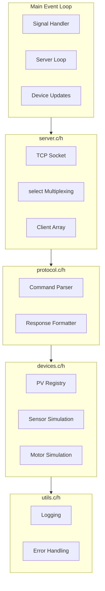

# M2 C Device Server - Detailed Implementation Plan

## Overview

Implement a production-quality TCP server in C that simulates synchrotron beamline devices. The server handles multiple concurrent clients using `select()` I/O multiplexing, implements an EPICS-style process variable (PV) system, and simulates sensors, motors, and shutters.

## Architecture



## Module Dependency Order

1. **utils.c/h** - No dependencies (logging, helpers)
2. **devices.c/h** - Depends on utils (PV registry, simulation)
3. **protocol.c/h** - Depends on devices (command execution)
4. **server.c/h** - Depends on protocol (TCP handling)
5. **main.c** - Depends on all (orchestration)

---

## Phase 2.1: Core Server

### Task 1: utils.c/h - Logging and Helpers

**File:** `device/src/utils.c`, `device/src/utils.h`

**Functions:**

```c
// Logging
void log_init(void);
void log_info(const char* fmt, ...);
void log_warn(const char* fmt, ...);
void log_error(const char* fmt, ...);
void log_debug(const char* fmt, ...);  // Optional

// Memory safety
void* safe_malloc(size_t size);
void* safe_realloc(void* ptr, size_t size);

// String utilities
void trim(char* str);
bool str_to_double(const char* str, double* out);
```

**Implementation Notes:**

- Use `syslog()` or `fprintf(stderr, ...)` for logging
- Include timestamps in log format
- `safe_malloc/realloc` exit on NULL (server should not continue)
- `trim` removes leading/trailing whitespace
- `str_to_double` uses `strtod()` with error checking

### Task 2: devices.c/h - PV Data Structures

**File:** `device/src/devices.c`, `device/src/devices.h`

**Data Structures:**

```c
typedef enum {
    PV_AI,  // Analog Input
    PV_AO,  // Analog Output
    PV_BI,  // Binary Input
    PV_BO   // Binary Output
} pv_type_t;

typedef struct {
    char name[BEAMLINE_PV_NAME_MAX];
    pv_type_t type;
    double value;
    double min;
    double max;
    bool writable;
    void (*update_fn)(struct pv_t*);  // For simulation
} pv_t;

typedef struct {
    pv_t* setpoint;
    pv_t* readback;
    pv_t* status_pv;  // IDLE/MOVING as double
    double velocity;  // units/s
    double accel;     // units/s²
    double target;
    bool moving;
} motor_t;

// Global registry
static pv_t g_pvs[BEAMLINE_MAX_PVS];
static int g_pv_count = 0;
static motor_t g_motors[8];  // X, Y, Z, THETA, MONO:ENERGY, etc.
static int g_motor_count = 0;
```

**Functions:**

```c
void devices_init(void);
void devices_update(double dt);  // Called in main loop
pv_t* pv_find(const char* name);
double pv_get(pv_t* pv);
bool pv_set(pv_t* pv, double value);
int pv_list(const char* pattern, char* buf, size_t len);
motor_t* motor_find(const char* name);
```

**Header Guard:**

```c
// devices.h
#ifndef BEAMLINE_DEVICES_H
#define BEAMLINE_DEVICES_H

#include <stdbool.h>
#include "config.h"

// ... declarations ...

#endif // BEAMLINE_DEVICES_H
```

### Task 3: devices.c - Sensor Simulation

**Sensors to Simulate:**

1. **BL02:RING:CURRENT** (AI)

   - Base: 350 mA
   - Noise: ±2 mA (Gaussian)
   - Range: 0-400 mA

2. **BL02:VACUUM:PRESSURE** (AI)

   - Base: 5e-9 mbar
   - Log-scale noise
   - Range: 1e-10 to 1e-8 mbar

3. **BL02:HUTCH:TEMP** (AI)

   - Base: 23°C
   - Slow drift: ±0.1°C over minutes
   - Range: 20-26°C

4. **BL02:DET:I0, IT, IF** (AI)

   - Photon counts
   - Proportional to ring current
   - I0: 0-1e6, IT: 0-1e6, IF: 0-1e5

5. **BL02:SHUTTER:STATUS** (BI)

   - Shutter state: 0=CLOSED, 1=OPEN
   - Read-only

6. **BL02:SHUTTER:CMD** (BO)

   - Shutter command: 0=CLOSE, 1=OPEN
   - Write-only, updates STATUS after delay

**Implementation:**

```c
static void update_ring_current(pv_t* pv) {
    double noise = (rand() / (double)RAND_MAX - 0.5) * 4.0;
    pv->value = 350.0 + noise;
    if (pv->value < 0) pv->value = 0;
    if (pv->value > 400) pv->value = 400;
}

static void update_vacuum(pv_t* pv) {
    // Log-scale: log10(pressure) with noise
    double log_p = -8.3 + (rand() / (double)RAND_MAX - 0.5) * 0.2;
    pv->value = pow(10, log_p);
}

static void update_temp(pv_t* pv) {
    // Slow drift
    static double drift = 0.0;
    drift += (rand() / (double)RAND_MAX - 0.5) * 0.01;
    pv->value = 23.0 + drift;
    // Clamp
    if (pv->value < 20) pv->value = 20;
    if (pv->value > 26) pv->value = 26;
}

static void update_detector_i0(pv_t* pv) {
    // Proportional to ring current
    pv_t* ring_current = pv_find("BL02:RING:CURRENT");
    if (!ring_current) return;

    double factor = ring_current->value / 350.0;  // Normalize
    double base = 500000.0;
    double noise = (rand() / (double)RAND_MAX - 0.5) * 10000.0;
    pv->value = base * factor + noise;

    if (pv->value < 0) pv->value = 0;
    if (pv->value > 1e6) pv->value = 1e6;
}

static void update_shutter_status(pv_t* pv) {
    // Status follows command after delay
    pv_t* cmd = pv_find("BL02:SHUTTER:CMD");
    if (cmd) {
        pv->value = cmd->value;  // Simplified: instant response
    }
}
```

### Task 4: protocol.c/h - Command Parsing

**File:** `device/src/protocol.c`, `device/src/protocol.h`

**Data Structures:**

```c
typedef enum {
    CMD_GET,
    CMD_PUT,
    CMD_MOVE,
    CMD_STATUS,
    CMD_LIST,
    CMD_MONITOR,
    CMD_STOP,
    CMD_PING,
    CMD_QUIT,
    CMD_INVALID
} cmd_type_t;

typedef struct {
    cmd_type_t type;
    char target[BEAMLINE_PV_NAME_MAX];
    double value;
    bool has_value;
    int monitor_interval_ms;  // For MONITOR command
} cmd_t;
```

**Error Codes:**

```c
typedef enum {
    ERR_UNKNOWN_CMD,
    ERR_UNKNOWN_PV,
    ERR_INVALID_VALUE,
    ERR_MOTOR_FAULT,
    ERR_INTERNAL
} error_code_t;
```

**Functions:**

```c
bool protocol_parse(const char* input, cmd_t* cmd);
void protocol_format_response(char* buf, size_t len, const char* status, const char* data);
void protocol_format_error(char* buf, size_t len, error_code_t err_code);
const char* error_code_string(error_code_t code);
```

**Header Guard:**

```c
// protocol.h
#ifndef BEAMLINE_PROTOCOL_H
#define BEAMLINE_PROTOCOL_H

#include <stdbool.h>
#include "config.h"

// ... declarations ...

#endif // BEAMLINE_PROTOCOL_H
```

**Parse Example:**

```c
// "GET:BL02:RING:CURRENT\n"
// "PUT:BL02:MONO:ENERGY:7112\n"
// "MONITOR:BL02:DET:I0:100\n"
```

**Response Format:**

- Success: `OK:<data>\n`
- Error: `ERR:<code>\n`

### Task 5: server.c/h - TCP Server (Single Client)

**File:** `device/src/server.c`, `device/src/server.h`

**Data Structures:**

```c
typedef struct {
    int fd;
    bool active;
    char recv_buf[BEAMLINE_CMD_BUFFER_SIZE];
    size_t recv_len;
    bool monitoring;
    char monitor_pv[BEAMLINE_PV_NAME_MAX];
    int monitor_interval_ms;
    int64_t last_monitor_time;
} client_t;

static client_t g_clients[BEAMLINE_MAX_CLIENTS];
static int g_client_count = 0;
```

**Functions:**

```c
int server_init(void);  // Returns listen_fd
void server_run_once(int listen_fd);  // One iteration of event loop
void server_cleanup(int listen_fd);
```

**Header Guard:**

```c
// server.h
#ifndef BEAMLINE_SERVER_H
#define BEAMLINE_SERVER_H

#include "config.h"

// ... declarations ...

#endif // BEAMLINE_SERVER_H
```

**Implementation Flow:**

1. `server_init()`: socket(), setsockopt(SO_REUSEADDR), bind(), listen()
2. `server_run_once()`:

   - Check for new connections (accept if pending)
   - For each active client:
     - Read data into recv_buf
     - If complete line (`\n` found):
       - Parse command
       - Execute (GET/PUT/PING/QUIT)
       - Send response
     - Handle MONITOR updates if active

3. Use blocking `accept()` and `recv()` with MSG_DONTWAIT flag

### Task 6: main.c - Signal Handling and Event Loop

**File:** `device/src/main.c`

**Implementation:**

```c
static volatile sig_atomic_t g_running = 1;

static void signal_handler(int sig) {
    (void)sig;
    g_running = 0;
    log_info("Received signal, shutting down...");
}

int main(void) {
    log_init();
    devices_init();

    int listen_fd = server_init();
    if (listen_fd < 0) {
        log_error("Failed to initialize server");
        return EXIT_FAILURE;
    }

    signal(SIGINT, signal_handler);
    signal(SIGTERM, signal_handler);

    log_info("Beamline simulator listening on port %d", BEAMLINE_PORT);

    struct timespec last_update = {0};
    clock_gettime(CLOCK_MONOTONIC, &last_update);

    while (g_running) {
        server_run_once(listen_fd);

        // Update devices every 10ms
        struct timespec now;
        clock_gettime(CLOCK_MONOTONIC, &now);
        double dt = (now.tv_sec - last_update.tv_sec) +
                    (now.tv_nsec - last_update.tv_nsec) / 1e9;
        if (dt >= 0.01) {
            devices_update(dt);
            last_update = now;
        }

        // Small sleep to prevent 100% CPU
        usleep(1000);  // 1ms
    }

    server_cleanup(listen_fd);
    log_info("Server shutdown complete");
    return EXIT_SUCCESS;
}
```

### Task 7: Update meson.build

**File:** `device/meson.build`

Add all source files:

```meson
src_files = files(
    'src/main.c',
    'src/utils.c',
    'src/devices.c',
    'src/protocol.c',
    'src/server.c',
)
```

Rebuild:

```bash
cd device
meson setup --wipe build
meson compile -C build
```

### Task 8: Manual Testing

Test with `telnet` or `nc`:

```bash
$ telnet localhost 5064
GET:BL02:RING:CURRENT
OK:350.5
PUT:BL02:MONO:ENERGY:7112
OK:PUT
PING
OK:PONG
QUIT
OK:BYE
```

---

## Phase 2.2: Multi-Client & Motors

### Task 8: server.c - select() Multiplexing

**Update `server_run_once()`:**

```c
void server_run_once(int listen_fd) {
    fd_set read_fds;
    FD_ZERO(&read_fds);
    FD_SET(listen_fd, &read_fds);
    int max_fd = listen_fd;

    // Add all client FDs
    for (int i = 0; i < BEAMLINE_MAX_CLIENTS; i++) {
        if (g_clients[i].active) {
            FD_SET(g_clients[i].fd, &read_fds);
            if (g_clients[i].fd > max_fd) {
                max_fd = g_clients[i].fd;
            }
        }
    }

    struct timeval timeout = {
        .tv_sec = 0,
        .tv_usec = BEAMLINE_SELECT_TIMEOUT_MS * 1000
    };

    int nready = select(max_fd + 1, &read_fds, NULL, NULL, &timeout);
    if (nready < 0) {
        if (errno != EINTR) {
            log_error("select() failed: %s", strerror(errno));
        }
        return;
    }

    // Check for new connection
    if (FD_ISSET(listen_fd, &read_fds)) {
        client_accept(listen_fd);
    }

    // Handle client data
    for (int i = 0; i < BEAMLINE_MAX_CLIENTS; i++) {
        if (g_clients[i].active && FD_ISSET(g_clients[i].fd, &read_fds)) {
            client_handle(&g_clients[i]);
        }
    }
}
```

**Helper Functions:**

```c
static void client_accept(int listen_fd);
static void client_handle(client_t* client);
static void client_disconnect(client_t* client);
```

### Task 9: devices.c - Motor Simulation

**Motor Update Logic:**

```c
void motor_update(motor_t* motor, double dt) {
    if (!motor->moving) return;

    double current = motor->readback->value;
    double diff = motor->target - current;

    if (fabs(diff) < 0.001) {
        // Reached target
        motor->moving = false;
        motor->readback->value = motor->target;
        motor->status_pv->value = 0.0;  // IDLE
        return;
    }

    // Linear interpolation (simplified)
    double rate = motor->velocity;
    double step = rate * dt;

    if (fabs(diff) < step) {
        motor->readback->value = motor->target;
        motor->moving = false;
        motor->status_pv->value = 0.0;
    } else {
        motor->readback->value += (diff > 0 ? step : -step);
        motor->status_pv->value = 1.0;  // MOVING
    }
}
```

**Motor Velocities:**

- Sample stages (X, Y, Z): 1000 μm/s
- Theta: 10 deg/s
- Monochromator: 100 eV/s

**Motor PV Naming Convention:**

Each motor has 3 PVs:

1. **Setpoint** (AO, writable): `BL02:SAMPLE:X`
2. **Readback** (AI, read-only): `BL02:SAMPLE:X.RBV`
3. **Status** (stored in motor_t): IDLE=0.0, MOVING=1.0

Example in `devices_init()`:

```c
// Create motor for BL02:SAMPLE:X
motor_t* motor_x = &g_motors[g_motor_count++];
motor_x->setpoint = pv_register("BL02:SAMPLE:X", PV_AO, -10000, 10000, true);
motor_x->readback = pv_register("BL02:SAMPLE:X.RBV", PV_AI, -10000, 10000, false);
motor_x->velocity = 1000.0;  // μm/s
motor_x->moving = false;
```

**MOVE Command Handler:**

```c
bool motor_move(const char* motor_name, double target) {
    motor_t* motor = motor_find(motor_name);
    if (!motor) return false;

    // Check limits
    if (target < motor->setpoint->min || target > motor->setpoint->max) {
        return false;
    }

    motor->target = target;
    motor->setpoint->value = target;
    motor->moving = true;
    motor->status_pv->value = 1.0;

    return true;
}
```

### Task 10: protocol.c - MOVE/STATUS/LIST Commands

**MOVE Command:**

```
MOVE:BL02:SAMPLE:X:1000
→ OK:MOVING
```

**STATUS Command:**

```
STATUS:BL02:SAMPLE:X
→ OK:IDLE
or
→ OK:MOVING
```

**LIST Command:**

```
LIST
→ OK:BL02:RING:CURRENT,BL02:MONO:ENERGY,BL02:SAMPLE:X,...

LIST:BL02:*
→ OK:BL02:RING:CURRENT,BL02:MONO:ENERGY,BL02:SAMPLE:X,...

LIST:*:DET:*
→ OK:BL02:DET:I0,BL02:DET:IT,BL02:DET:IF
```

**Glob Pattern Matching:**

- Simple implementation: `*` matches any substring
- Use `strstr()` for pattern matching

### Task 11: protocol.c - MONITOR/STOP Commands

**MONITOR Command:**

```
MONITOR:BL02:DET:I0:100
→ DATA:12345
→ DATA:12350
→ DATA:12348
...
```

**Implementation:**

- Store monitor state in `client_t`
- In `client_handle()`, check if monitoring is active
- If interval elapsed, send `DATA:<value>\n`
- Use `clock_gettime()` for timing

**STOP Command:**

```
STOP
→ OK:STOPPED
```

- Clears monitoring state for client

### Task 12: CMocka Unit Tests

**File:** `device/tests/test_protocol.c`

```c
#include <cmocka.h>
#include "../src/protocol.h"

static void test_parse_get(void** state) {
    (void)state;
    cmd_t cmd;
    assert_true(protocol_parse("GET:BL02:RING:CURRENT\n", &cmd));
    assert_int_equal(cmd.type, CMD_GET);
    assert_string_equal(cmd.target, "BL02:RING:CURRENT");
}

static void test_parse_put(void** state) {
    (void)state;
    cmd_t cmd;
    assert_true(protocol_parse("PUT:BL02:MONO:ENERGY:7112\n", &cmd));
    assert_int_equal(cmd.type, CMD_PUT);
    assert_string_equal(cmd.target, "BL02:MONO:ENERGY");
    assert_true(cmd.has_value);
    assert_double_equal(cmd.value, 7112.0, 0.001);
}
```

**File:** `device/tests/test_devices.c`

```c
#include <cmocka.h>
#include "../src/devices.h"

static void test_pv_find(void** state) {
    (void)state;
    devices_init();
    pv_t* pv = pv_find("BL02:RING:CURRENT");
    assert_non_null(pv);
    assert_string_equal(pv->name, "BL02:RING:CURRENT");
}

static void test_pv_get_set(void** state) {
    (void)state;
    devices_init();
    pv_t* pv = pv_find("BL02:MONO:ENERGY");
    assert_non_null(pv);
    assert_true(pv_set(pv, 8000.0));
    assert_double_equal(pv_get(pv), 8000.0, 0.001);
}
```

**Update meson.build:**

```meson
cmocka_dep = dependency('cmocka', required: false)
if cmocka_dep.found()
    test_protocol = executable(
        'test_protocol',
        'tests/test_protocol.c',
        'src/protocol.c',
        include_directories: inc_dirs,
        dependencies: cmocka_dep,
    )
    test('protocol', test_protocol)

    test_devices = executable(
        'test_devices',
        'tests/test_devices.c',
        'src/devices.c',
        'src/utils.c',
        include_directories: inc_dirs,
        dependencies: cmocka_dep,
    )
    test('devices', test_devices)
endif
```

### Task 13: Quality Checks

**Valgrind:**

```bash
meson test --wrap='valgrind --leak-check=full --error-exitcode=1'
```

**ASan (already enabled in meson.build):**

```bash
meson setup build -Db_sanitize=address,undefined
meson compile -C build
```

---

## Implementation Checklist

### Phase 2.1

- [ ] utils.h - Header with logging/helper function declarations, include guards
- [ ] utils.c - Implement logging (log_init, log_info, log_error, etc.)
- [ ] utils.c - Implement helpers (safe_malloc, trim, str_to_double)
- [ ] devices.h - Define pv_t, motor_t structs, function declarations, include guards
- [ ] devices.c - Implement pv_find, pv_get, pv_set, pv_list functions
- [ ] devices.c - Implement devices_init() with sensor registration (6 sensors + shutter)
- [ ] devices.c - Implement sensor update functions (ring current, vacuum, temp, detectors)
- [ ] protocol.h - Define cmd_t, error_code_t, function declarations, include guards
- [ ] protocol.c - Implement protocol_parse() for GET/PUT/PING/QUIT
- [ ] protocol.c - Implement protocol_format_response/error functions
- [ ] server.h - Define client_t struct, function declarations, include guards
- [ ] server.c - Implement server_init() (socket, bind, listen)
- [ ] server.c - Implement server_run_once() for single client (accept, recv, send)
- [ ] server.c - Implement server_cleanup()
- [ ] main.c - Update with signal handler, event loop, devices_update() calls
- [ ] meson.build - Add all source files to src_files
- [ ] Build and test with telnet

### Phase 2.2

- [ ] server.c - Update server_run_once() with select() for multi-client
- [ ] server.c - Implement client_accept(), client_handle(), client_disconnect()
- [ ] devices.c - Add motor_find(), motor_move() functions
- [ ] devices.c - Implement motor_update() with linear interpolation
- [ ] devices.c - Register all motors in devices_init() (X, Y, Z, THETA, ENERGY)
- [ ] protocol.c - Add MOVE command parsing and execution
- [ ] protocol.c - Add STATUS command parsing and execution
- [ ] protocol.c - Add LIST command with glob pattern matching
- [ ] protocol.c - Add MONITOR command with interval tracking
- [ ] protocol.c - Add STOP command to clear monitoring
- [ ] tests/test_protocol.c - CMocka tests for command parsing
- [ ] tests/test_devices.c - CMocka tests for PV registry and motors
- [ ] meson.build - Add test executables with cmocka dependency
- [ ] Run meson test
- [ ] Run Valgrind: meson test --wrap='valgrind --leak-check=full'
- [ ] Manual stress test: connect 10+ telnet clients simultaneously

---

## Design Decisions

1. **Simple over Complex**: Linear interpolation for motors instead of full trapezoidal profile
2. **Global State**: Static arrays for PVs and clients (no dynamic allocation)
3. **Blocking I/O**: `select()` with timeout, non-blocking recv with MSG_DONTWAIT
4. **String Protocol**: Text-based for easy debugging (no binary protocol)
5. **No Threading**: Single-threaded event loop (simpler, sufficient for expected load)

## Risk Mitigation

- **Buffer Overflow**: Always use `snprintf()`, check bounds
- **Partial Reads**: Accumulate in recv_buf, process on `\n`
- **FD Leaks**: Always `close()` on disconnect
- **Memory Leaks**: No dynamic allocation (except safe_malloc for future use)
- **Race Conditions**: None (single-threaded)
- **Null Pointers**: Check all pv_find() results before dereferencing

## Implementation Order

Strict order to respect dependencies:

1. **utils.h/c** - Foundation (no deps)
2. **devices.h** - Data structures
3. **protocol.h** - Data structures
4. **server.h** - Data structures
5. **devices.c** - Implementation (uses utils)
6. **protocol.c** - Implementation (uses devices)
7. **server.c** - Implementation (uses protocol)
8. **main.c** - Orchestration (uses all)
9. **meson.build** - Build system update
10. **Test Phase 2.1**
11. **Enhance server.c** - select() multiplexing
12. **Enhance devices.c** - Motor simulation
13. **Enhance protocol.c** - Advanced commands
14. **tests/\*.c** - Unit tests
15. **Test Phase 2.2**
