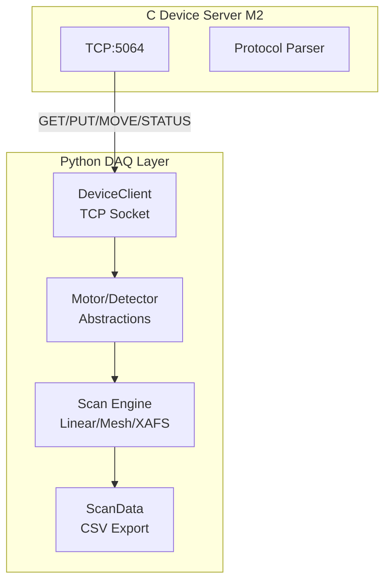

# M3 Python DAQ Layer - Detailed Implementation Plan

## Overview

Implement a production-quality Python data acquisition (DAQ) layer that communicates with the C device server via TCP, provides high-level device abstractions, orchestrates scientific scans, and exports data to CSV format. This milestone bridges the C server (M2) with future analysis modules (M4).

## Architecture



## Module Structure

```
python/beamline/daq/
├── __init__.py          # Public API exports
├── client.py            # DeviceClient (TCP communication)
├── device.py            # Motor, Detector, Shutter abstractions
├── scan.py              # ScanEngine, LinearScan, MeshScan, XAFSScan
├── data.py              # ScanData container, CSV export
└── exceptions.py        # Custom exceptions
```

## Phase 3.1: DeviceClient (Low-Level TCP Communication)

### File: `python/beamline/daq/client.py`

**Responsibilities:**

- TCP socket management
- Protocol message formatting and parsing
- Connection lifecycle (connect, disconnect, context manager)
- Error handling and retries

**Class Design:**

```python
class DeviceClient:
    """Low-level TCP client for beamline device server.

    Handles raw protocol communication: GET, PUT, MOVE, STATUS, LIST, MONITOR, STOP.
    Thread-safe for single connection (not thread-safe across multiple connections).
    """

    def __init__(
        self,
        host: str = "localhost",
        port: int = 5064,
        timeout: float = 5.0,
    ) -> None:
        """Initialize client with connection parameters.

        Args:
            host: Server hostname or IP address
            port: TCP port (default: 5064, EPICS standard)
            timeout: Socket timeout in seconds
        """

    def __enter__(self) -> "DeviceClient":
        """Context manager entry: connect to server."""

    def __exit__(
        self,
        exc_type: type[BaseException] | None,
        exc_val: BaseException | None,
        exc_tb: TracebackType | None,
    ) -> None:
        """Context manager exit: close connection."""

    def connect(self) -> None:
        """Establish TCP connection to server."""

    def disconnect(self) -> None:
        """Close TCP connection."""

    def get(self, pv: str) -> float:
        """Read process variable value.

        Args:
            pv: Process variable name (e.g., "BL02:RING:CURRENT")

        Returns:
            PV value as float

        Raises:
            ConnectionError: If not connected
            ProtocolError: If server returns error response
            ValueError: If response cannot be parsed as float
        """

    def put(self, pv: str, value: float) -> None:
        """Write process variable value.

        Args:
            pv: Process variable name
            value: Value to write

        Raises:
            ConnectionError: If not connected
            ProtocolError: If server returns error (e.g., ERR:INVALID_VALUE)
        """

    def move(self, motor: str, position: float) -> None:
        """Move motor to position (asynchronous, non-blocking).

        Args:
            motor: Motor PV name (e.g., "BL02:SAMPLE:X")
            position: Target position

        Raises:
            ProtocolError: If motor not found or invalid position
        """

    def status(self, motor: str) -> MotorStatus:
        """Get motor status.

        Args:
            motor: Motor PV name

        Returns:
            MotorStatus enum (IDLE or MOVING)
        """

    def list_pvs(self, pattern: str | None = None) -> list[str]:
        """List process variables, optionally filtered by pattern.

        Args:
            pattern: Optional glob pattern (e.g., "BL02:DET:*")

        Returns:
            List of PV names
        """

    def monitor_start(self, pv: str, interval_ms: int) -> None:
        """Start monitoring PV with periodic updates.

        Note: Monitoring implementation deferred to Phase 3.2 (async support).
        """

    def monitor_stop(self) -> None:
        """Stop monitoring."""

    # Private methods
    def _send_command(self, command: str) -> str:
        """Send command and receive response.

        Internal method handling socket I/O and protocol parsing.
        """

    def _parse_response(self, response: str) -> tuple[str, str]:
        """Parse response: "OK:data" or "ERR:code".

        Returns:
            (status, data) tuple
        """
```

**Implementation Details:**

1.  **Socket Management:**

                                                - Use `socket.socket(socket.AF_INET, socket.SOCK_STREAM)`
                                                - Set `socket.settimeout(timeout)` for non-blocking operations
                                                - Handle `socket.timeout` exceptions

2.  **Protocol Parsing:**

                                                - Commands: `f"{cmd}:{target}:{value}\n"` format
                                                - Responses: `"OK:{data}\n"` or `"ERR:{code}\n"`
                                                - Strip newlines, handle empty responses

3.  **Error Handling:**

                                                - Custom exceptions: `ConnectionError`, `ProtocolError`, `TimeoutError`
                                                - Map server error codes to Python exceptions
                                                - Retry logic for transient failures (optional, Phase 3.1+)

4.  **Type Safety:**

                                                - Full type hints (mypy strict mode)
                                                - Pydantic validation for PV names (optional, can use regex)

**Testing Strategy:**

- Unit tests with `unittest.mock` for socket operations
- Integration tests against real C server (requires server running)
- Test error cases: connection refused, timeout, invalid responses

---

## Phase 3.2: Device Abstractions (High-Level API)

### File: `python/beamline/daq/device.py`

**Responsibilities:**

- High-level device abstractions (Motor, Detector, Shutter)
- Pydantic models for type safety and validation
- Convenience methods (move_to, wait_for_idle)

**Class Design:**

```python
from pydantic import BaseModel, Field, field_validator
from enum import Enum

class MotorStatus(str, Enum):
    """Motor status enumeration."""
    IDLE = "IDLE"
    MOVING = "MOVING"

class Motor(BaseModel):
    """High-level motor abstraction.

    Provides convenient methods for motor control with automatic readback
    and status polling.
    """

    pv: str = Field(..., description="Motor setpoint PV (e.g., 'BL02:SAMPLE:X')")
    client: DeviceClient = Field(..., description="DeviceClient instance")

    model_config = ConfigDict(strict=True, arbitrary_types_allowed=True)

    @field_validator("pv")
    @classmethod
    def validate_pv(cls, v: str) -> str:
        """Validate PV name format."""
        if not v or ":" not in v:
            raise ValueError(f"Invalid PV name: {v}")
        return v

    def move_to(self, position: float, wait: bool = True, timeout: float = 60.0) -> None:
        """Move motor to target position.

        Args:
            position: Target position
            wait: If True, block until motor reaches target
            timeout: Maximum wait time in seconds (if wait=True)

        Raises:
            TimeoutError: If motor doesn't reach target within timeout
        """

    def position(self) -> float:
        """Read current motor position (readback PV).

        Returns:
            Current position from .RBV PV
        """

    def status(self) -> MotorStatus:
        """Get motor status.

        Returns:
            MotorStatus enum
        """

    def wait_for_idle(self, timeout: float = 60.0, poll_interval: float = 0.1) -> None:
        """Wait until motor is idle.

        Polls STATUS command until IDLE or timeout.

        Args:
            timeout: Maximum wait time in seconds
            poll_interval: Polling interval in seconds
        """

    @property
    def readback_pv(self) -> str:
        """Get readback PV name (.RBV suffix)."""
        return f"{self.pv}.RBV"


class Detector(BaseModel):
    """High-level detector abstraction."""

    pv: str = Field(..., description="Detector PV name")
    client: DeviceClient = Field(..., description="DeviceClient instance")

    model_config = ConfigDict(strict=True, arbitrary_types_allowed=True)

    def read(self) -> float:
        """Read detector value.

        Returns:
            Detector reading
        """

    def read_multiple(self, n: int, dwell_time: float = 0.1) -> np.ndarray:
        """Read detector multiple times and return average.

        Useful for noise reduction.

        Args:
            n: Number of readings
            dwell_time: Time between readings in seconds

        Returns:
            Array of readings
        """


class Shutter(BaseModel):
    """Shutter control abstraction."""

    status_pv: str = Field(default="BL02:SHUTTER:STATUS")
    cmd_pv: str = Field(default="BL02:SHUTTER:CMD")
    client: DeviceClient = Field(..., description="DeviceClient instance")

    model_config = ConfigDict(strict=True, arbitrary_types_allowed=True)

    def open(self) -> None:
        """Open shutter."""
        self.client.put(self.cmd_pv, 1.0)

    def close(self) -> None:
        """Close shutter."""
        self.client.put(self.cmd_pv, 0.0)

    def is_open(self) -> bool:
        """Check if shutter is open."""
        return self.client.get(self.status_pv) > 0.5
```

**Implementation Details:**

1.  **Pydantic Models:**

                                                - Use `BaseModel` with `strict=True` for type safety
                                                - `arbitrary_types_allowed=True` for DeviceClient (not a Pydantic model)
                                                - Field validators for PV name format

2.  **Motor Movement:**

                                                - `move_to()` calls `client.move()`, then optionally `wait_for_idle()`
                                                - `wait_for_idle()` polls STATUS with exponential backoff (optional)

3.  **Error Handling:**

                                                - Wrap client exceptions with device-specific context
                                                - Timeout handling for motor movements

**Testing Strategy:**

- Unit tests with mocked DeviceClient
- Integration tests with real server
- Test motor movement, status polling, timeout scenarios

---

## Phase 3.3: Scan Engine

### File: `python/beamline/daq/scan.py`

**Responsibilities:**

- Scan configuration models (Pydantic)
- Scan execution engine
- Three scan types: Linear, Mesh, XAFS

**Class Design:**

```python
from pydantic import BaseModel, Field, field_validator
from typing import Literal
import numpy as np

class ScanConfig(BaseModel):
    """Base scan configuration."""

    detectors: list[str] = Field(..., min_length=1, description="List of detector PVs")
    dwell_time: float = Field(default=0.1, gt=0, description="Dwell time per point (seconds)")

    model_config = ConfigDict(strict=True)


class LinearScanConfig(ScanConfig):
    """Linear 1D scan configuration."""

    scan_type: Literal["linear"] = "linear"
    motor: str = Field(..., description="Motor PV name")
    start: float = Field(..., description="Start position")
    stop: float = Field(..., description="Stop position")
    steps: int = Field(..., gt=0, description="Number of steps")

    @field_validator("stop")
    @classmethod
    def validate_range(cls, v: float, info) -> float:
        """Validate start < stop."""
        if "start" in info.data and v <= info.data["start"]:
            raise ValueError("stop must be greater than start")
        return v

    @property
    def positions(self) -> np.ndarray:
        """Generate motor positions array."""
        return np.linspace(self.start, self.stop, self.steps)


class MeshScanConfig(ScanConfig):
    """2D mesh scan configuration."""

    scan_type: Literal["mesh"] = "mesh"
    motor1: tuple[str, float, float, int] = Field(
        ..., description="(PV, start, stop, steps) for first motor"
    )
    motor2: tuple[str, float, float, int] = Field(
        ..., description="(PV, start, stop, steps) for second motor"
    )

    @property
    def positions1(self) -> np.ndarray:
        """Generate motor1 positions."""
        pv, start, stop, steps = self.motor1
        return np.linspace(start, stop, steps)

    @property
    def positions2(self) -> np.ndarray:
        """Generate motor2 positions."""
        pv, start, stop, steps = self.motor2
        return np.linspace(start, stop, steps)


class XAFSScanConfig(ScanConfig):
    """XAFS energy scan configuration with variable step sizes."""

    scan_type: Literal["xafs"] = "xafs"
    energy_pv: str = Field(default="BL02:MONO:ENERGY", description="Energy PV name")
    edge: float = Field(..., gt=0, description="Absorption edge energy (eV)")
    regions: list[tuple[float, float, float]] = Field(
        ...,
        description="List of (start_offset, stop_offset, step_size) tuples in eV"
    )

    @field_validator("regions")
    @classmethod
    def validate_regions(cls, v: list[tuple[float, float, float]]) -> list[tuple[float, float, float]]:
        """Validate regions are non-overlapping and ordered."""
        # Check ordering and non-overlap
        return v

    def generate_energies(self) -> np.ndarray:
        """Generate energy array from regions."""
        energies = []
        for start_offset, stop_offset, step_size in self.regions:
            start = self.edge + start_offset
            stop = self.edge + stop_offset
            n_steps = int((stop - start) / step_size) + 1
            energies.extend(np.linspace(start, stop, n_steps))
        return np.array(energies)


class ScanEngine:
    """Scan execution engine."""

    def __init__(self, client: DeviceClient) -> None:
        """Initialize scan engine with device client."""
        self.client = client

    def run_linear(self, config: LinearScanConfig) -> ScanData:
        """Execute linear scan.

        Algorithm:
 1. Generate motor positions
 2. For each position:
           a. Move motor to position (wait for completion)
           b. Sleep dwell_time
           c. Read all detectors
           d. Record timestamp
 3. Return ScanData
        """

    def run_mesh(self, config: MeshScanConfig) -> ScanData:
        """Execute 2D mesh scan.

        Algorithm:
 1. Generate motor1 and motor2 position grids
 2. For each (pos1, pos2) combination:
           a. Move both motors
           b. Wait for both to be idle
           c. Sleep dwell_time
           d. Read all detectors
 3. Return ScanData with 2D arrays
        """

    def run_xafs(self, config: XAFSScanConfig) -> ScanData:
        """Execute XAFS energy scan.

        Algorithm:
 1. Generate energy array from regions
 2. For each energy:
           a. Move monochromator to energy
           b. Wait for completion
           c. Sleep dwell_time
           d. Read all detectors (I0, IT, IF)
 3. Return ScanData
        """

    def run(self, config: ScanConfig | LinearScanConfig | MeshScanConfig | XAFSScanConfig) -> ScanData:
        """Run scan based on config type.

        Dispatches to appropriate run_* method.
        """
```

**Implementation Details:**

1.  **Scan Execution:**

                                                - Use Motor abstraction for movement (Phase 3.2)
                                                - Time.sleep() for dwell_time (simple, sufficient for M3)
                                                - Record timestamps with `time.time()` or `time.perf_counter()`

2.  **Data Collection:**

                                                - Build numpy arrays incrementally (pre-allocate if possible)
                                                - Store in ScanData structure (Phase 3.4)

3.  **Error Handling:**

                                                - Handle motor timeouts gracefully
                                                - Continue scan on detector read errors (log warning)
                                                - Save partial data on interruption

**Testing Strategy:**

- Unit tests with mocked DeviceClient
- Integration tests with real server (small scans: 5-10 points)
- Test edge cases: zero steps, invalid ranges, timeout scenarios

---

## Phase 3.4: Data Export

### File: `python/beamline/daq/data.py`

**Responsibilities:**

- ScanData container (dataclass)
- CSV export functionality
- Metadata management

**Class Design:**

```python
from dataclasses import dataclass, field
from datetime import datetime
import numpy as np
from pathlib import Path

@dataclass
class ScanData:
    """Container for scan data with metadata.

    Stores motor positions, detector readings, timestamps, and metadata.
    """

    motor_positions: dict[str, np.ndarray] = field(
        default_factory=dict,
        description="Motor PV -> position array mapping"
    )
    detector_readings: dict[str, np.ndarray] = field(
        default_factory=dict,
        description="Detector PV -> reading array mapping"
    )
    timestamps: np.ndarray = field(
        default_factory=lambda: np.array([]),
        description="Timestamp array (seconds since epoch)"
    )
    metadata: dict[str, Any] = field(
        default_factory=dict,
        description="Scan metadata (type, config, user, etc.)"
    )

    def to_csv(self, path: Path | str, delimiter: str = ",") -> None:
        """Export scan data to CSV file.

        CSV format:
 - Header row: timestamp, motor1_pos, motor2_pos, det1, det2, ...
 - Data rows: one per scan point

        Args:
            path: Output file path
            delimiter: CSV delimiter (default: comma)
        """

    def validate(self) -> None:
        """Validate data consistency.

        Checks:
 - All arrays have same length
 - Timestamps are monotonically increasing
 - No NaN or Inf values

        Raises:
            ValueError: If validation fails
        """
```

**CSV Format Example:**

```csv
timestamp,BL02:SAMPLE:X,BL02:DET:I0,BL02:DET:IT
1705123456.123,-1000.0,500000.0,450000.0
1705123456.223,-900.0,501000.0,451000.0
...
```

**Implementation Details:**

1.  **CSV Export:**

                                                - Use `csv.writer` (standard library, no pandas dependency)
                                                - Handle numpy arrays directly
                                                - Write header from dict keys
                                                - Transpose data for row-wise writing

2.  **Data Validation:**

                                                - Check array lengths match
                                                - Validate numeric ranges (no NaN/Inf)
                                                - Check timestamp ordering

**Testing Strategy:**

- Unit tests: CSV roundtrip (write, read, compare)
- Test with various data shapes (1D, 2D mesh)
- Test edge cases: empty data, single point, missing detectors

---

## Phase 3.5: Integration & Testing

### File: `python/beamline/daq/__init__.py`

**Public API Exports:**

```python
"""Beamline DAQ package for device control and data acquisition."""

from beamline.daq.client import DeviceClient
from beamline.daq.device import Motor, Detector, Shutter, MotorStatus
from beamline.daq.scan import (
    ScanConfig,
    LinearScanConfig,
    MeshScanConfig,
    XAFSScanConfig,
    ScanEngine,
)
from beamline.daq.data import ScanData

__all__ = [
    "DeviceClient",
    "Motor",
    "Detector",
    "Shutter",
    "MotorStatus",
    "ScanConfig",
    "LinearScanConfig",
    "MeshScanConfig",
    "XAFSScanConfig",
    "ScanEngine",
    "ScanData",
]
```

### Test Files

**`python/tests/test_client.py`:**

- Mock socket tests
- Integration tests (requires server)
- Error handling tests

**`python/tests/test_device.py`:**

- Motor movement tests
- Detector reading tests
- Shutter control tests

**`python/tests/test_scan.py`:**

- Linear scan execution
- Mesh scan execution
- XAFS scan execution
- Config validation tests

**`python/tests/test_data.py`:**

- CSV export/import roundtrip
- Data validation tests

### Example Script

**`examples/02_linear_scan.py`:**

```python
"""Example: Linear scan with motor and detectors."""

from beamline.daq import DeviceClient, Motor, Detector, ScanEngine, LinearScanConfig

def main():
    with DeviceClient("localhost", 5064) as client:
        # Create devices
        motor_x = Motor(pv="BL02:SAMPLE:X", client=client)
        det_i0 = Detector(pv="BL02:DET:I0", client=client)

        # Configure scan
        config = LinearScanConfig(
            motor="BL02:SAMPLE:X",
            start=-1000.0,
            stop=1000.0,
            steps=100,
            detectors=["BL02:DET:I0", "BL02:DET:IT"],
            dwell_time=0.1,
        )

        # Run scan
        engine = ScanEngine(client)
        data = engine.run_linear(config)

        # Export
        data.to_csv("scan_001.csv")
        print(f"Scan complete: {len(data.timestamps)} points")

if __name__ == "__main__":
    main()
```

---

## Implementation Checklist

### Phase 3.1: DeviceClient

- [ ] `client.py` - TCP socket wrapper
- [ ] `exceptions.py` - Custom exceptions
- [ ] Unit tests with mocked socket
- [ ] Integration tests with real server
- [ ] Context manager support
- [ ] Error handling and timeouts

### Phase 3.2: Device Abstractions

- [ ] `device.py` - Motor, Detector, Shutter classes
- [ ] Pydantic models with validation
- [ ] Motor movement and status polling
- [ ] Unit tests with mocked client
- [ ] Integration tests

### Phase 3.3: Scan Engine

- [ ] `scan.py` - ScanEngine and config models
- [ ] LinearScan implementation
- [ ] MeshScan implementation
- [ ] XAFSScan implementation
- [ ] Config validation (Pydantic)
- [ ] Integration tests (small scans)

### Phase 3.4: Data Export

- [ ] `data.py` - ScanData dataclass
- [ ] CSV export implementation
- [ ] Data validation
- [ ] Unit tests (CSV roundtrip)

### Phase 3.5: Integration

- [ ] `__init__.py` - Public API exports
- [ ] Example scripts
- [ ] Documentation (docstrings)
- [ ] End-to-end test with real server
- [ ] Update README with usage examples

---

## Success Criteria

- DeviceClient successfully communicates with C server (all commands)
- Motor movements complete with status polling
- Linear scan produces correct CSV output
- Mesh scan handles 2D grid correctly
- XAFS scan generates variable step energy array
- All tests pass (unit + integration)
- mypy strict mode passes
- ruff lint/format passes
- 80%+ test coverage

---

## Dependencies

**New dependencies (add to `pyproject.toml`):**

- None (all standard library + existing numpy)

**Optional (for future):**

- `pandas` - Alternative CSV export (not needed for M3)
- `asyncio` - Async monitoring support (Phase 3.2+)

---

## Notes

- **Sync vs Async:** M3 uses synchronous socket I/O. Async support (monitoring) can be added later.
- **Error Recovery:** Basic retry logic in DeviceClient (optional). Full recovery in M5.
- **Performance:** Pre-allocate numpy arrays when possible for large scans.
- **NeXus Export:** Deferred to M5 (requires h5py integration).
