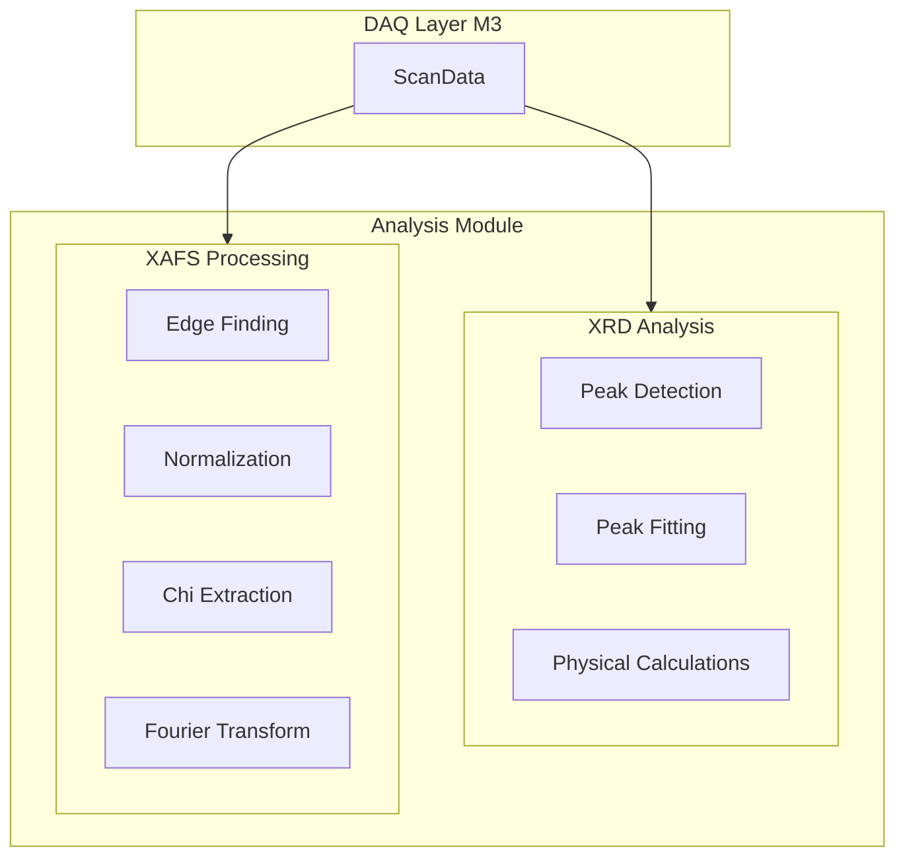

# M4 Analysis Module - Detailed Implementation Plan

## Overview

Implement a production-quality scientific analysis module for X-ray diffraction (XRD) and X-ray absorption fine structure (XAFS) data processing. This module provides stateless, pure functions for peak detection, profile fitting, physical property calculations, XAFS normalization, chi(k) extraction, and Fourier transform analysis. Designed for integration with the DAQ layer (M3) scan data.

## Architecture



## Module Structure

```
python/beamline/analysis/
├── __init__.py          # Public API exports
├── xrd.py               # XRD analysis utilities
└── xafs.py              # XAFS processing utilities
```

## 2026 Best Practices

### Type Hints

- Use `from __future__ import annotations` for forward references
- Use `numpy.typing.NDArray[np.float64]` for array type hints
- Strict type checking with mypy (no `Any` returns)
- Use `Literal` types for model selection

### Scientific Computing

- NumPy arrays with explicit `dtype=np.float64` for numerical stability
- SciPy integration: `scipy.signal.find_peaks`, `scipy.optimize.curve_fit`, `scipy.interpolate.UnivariateSpline`, `scipy.fft`
- Use `scipy-stubs` package for better IDE support
- Stateless classes (no instance state, pure functions)

### Testing

- Unit tests with known input/output cases
- Property-based testing with Hypothesis for numerical stability
- Test edge cases: empty arrays, single points, extreme values
- Test physical calculations with known materials

### Documentation

- Comprehensive docstrings with Args/Returns/Raises
- Mathematical formulas in docstrings
- Type hints as documentation

## Phase 4.1: XRD Core - Peak Detection

### File: `python/beamline/analysis/xrd.py`

### Peak Dataclass

```python
@dataclass
class Peak:
    """Represents a diffraction peak.

    Attributes:
        position: Peak position in two-theta degrees
        intensity: Peak intensity (maximum value)
        fwhm: Full width at half maximum in degrees
        hkl_indices: Optional Miller indices (h, k, l)
    """
    position: float
    intensity: float
    fwhm: float
    hkl_indices: tuple[int, int, int] | None = None
```

### XRDAnalyzer Class

```python
class XRDAnalyzer:
    """X-ray diffraction analysis utilities.

    Stateless class for peak finding, fitting, and physical calculations.
    """

    def find_peaks(
        self,
        two_theta: NDArray[np.float64],
        intensity: NDArray[np.float64],
        prominence: float = 0.1,
        width: float | None = None,
        distance: float | None = None,
    ) -> list[Peak]:
        """Find diffraction peaks using scipy.signal.find_peaks.

        Uses prominence-based detection which is robust to baseline
        variations. FWHM is calculated via interpolation.

        Args:
            two_theta: Two-theta values in degrees
            intensity: Intensity values
            prominence: Minimum peak prominence (relative to baseline)
            width: Minimum peak width in degrees (optional)
            distance: Minimum distance between peaks in degrees (optional)

        Returns:
            List of Peak objects sorted by position

        Raises:
            ValueError: If arrays have different lengths
            ValueError: If arrays are empty
        """
```

**Implementation Details:**

- Use `scipy.signal.find_peaks` with `prominence`, `width`, `distance` parameters
- Calculate FWHM using interpolation method: find half-max points on both sides
- Sort peaks by position
- Handle edge cases: single peak, no peaks, overlapping peaks

### Testing Strategy

```python
def test_find_peaks_simple():
    """Test with known Gaussian peaks."""

def test_find_peaks_no_peaks():
    """Test with flat baseline."""

def test_find_peaks_single_peak():
    """Test with single isolated peak."""

@given(
    two_theta=arrays(float, shape=st.integers(min_value=10, max_value=1000)),
    num_peaks=st.integers(min_value=1, max_value=10),
)
def test_find_peaks_property_based(two_theta, num_peaks):
    """Property-based test for numerical stability."""
```

## Phase 4.2: XRD Peak Fitting

### FitResult Dataclass

```python
@dataclass
class FitResult:
    """Results from peak profile fitting.

    Attributes:
        center: Fitted peak center in degrees
        amplitude: Fitted peak amplitude
        width: Fitted peak width (FWHM) in degrees
        background: Fitted background level
        model_type: Profile model used
        chi_squared: Reduced chi-squared value
        uncertainties: Dictionary of parameter uncertainties
    """
    center: float
    amplitude: float
    width: float
    background: float
    model_type: Literal["gaussian", "lorentzian", "pseudo_voigt"]
    chi_squared: float
    uncertainties: dict[str, float]
```

### Peak Fitting Method

```python
def fit_peak(
    self,
    two_theta: NDArray[np.float64],
    intensity: NDArray[np.float64],
    center: float,
    model: Literal["gaussian", "lorentzian", "pseudo_voigt"] = "gaussian",
    background_order: int = 1,
    width_estimate: float | None = None,
) -> FitResult:
    """Fit a single diffraction peak with profile function.

    Supports Gaussian, Lorentzian, and Pseudo-Voigt profiles.
    Background is modeled as polynomial (order 0, 1, or 2).

    Uses scipy.optimize.curve_fit with bounds and initial parameter
    estimation.

    Args:
        two_theta: Two-theta values in degrees
        intensity: Intensity values
        center: Initial guess for peak center
        model: Profile model type
        background_order: Polynomial background order (0, 1, or 2)
        width_estimate: Initial guess for FWHM (optional)

    Returns:
        FitResult with fitted parameters and uncertainties

    Raises:
        ValueError: If arrays have different lengths
        RuntimeError: If fitting fails to converge
    """
```

**Profile Models:**

1. **Gaussian:**

   ```
   I(θ) = A * exp(-0.5 * ((θ - θ₀) / σ)²) + bg(θ)
   σ = FWHM / (2 * sqrt(2 * ln(2)))
   ```

2. **Lorentzian:**

   ```
   I(θ) = A / (1 + ((θ - θ₀) / (FWHM/2))²) + bg(θ)
   ```

3. **Pseudo-Voigt:**
   ```
   I(θ) = η * Gaussian(θ) + (1 - η) * Lorentzian(θ)
   ```

Where η is the mixing parameter (0-1).

**Implementation Details:**

- Use `scipy.optimize.curve_fit` with bounds
- Initial parameter estimation: center from input, amplitude from max intensity, width from FWHM estimate or data
- Background estimation: fit polynomial to edge regions
- Parameter bounds: center ± range, amplitude > 0, width > 0, background reasonable
- Calculate uncertainties from covariance matrix diagonal
- Calculate reduced chi-squared: χ²_red = χ² / (N - n_params)

### Testing Strategy

```python
def test_fit_gaussian():
    """Test Gaussian fitting with known parameters."""

def test_fit_lorentzian():
    """Test Lorentzian fitting."""

def test_fit_pseudo_voigt():
    """Test Pseudo-Voigt fitting."""

def test_fit_with_background():
    """Test fitting with polynomial background."""

def test_fit_convergence_failure():
    """Test handling of convergence failures."""
```

## Phase 4.3: XRD Physical Calculations

### d-Spacing Calculation

```python
def calculate_d_spacing(
    self,
    two_theta: float,
    wavelength: float,
) -> float:
    """Calculate d-spacing from Bragg's law.

    Formula: d = λ / (2 * sin(θ))

    Args:
        two_theta: Two-theta angle in degrees
        wavelength: X-ray wavelength in Angstroms

    Returns:
        d-spacing in Angstroms
    """
```

### Crystallite Size Estimation (Scherrer Equation)

```python
def estimate_crystallite_size(
    self,
    fwhm: float,
    two_theta: float,
    wavelength: float,
    k_factor: float = 0.9,
) -> float:
    """Estimate crystallite size using Scherrer equation.

    Formula: D = K * λ / (β * cos(θ))
    Where:
        D: Crystallite size
        K: Shape factor (typically 0.9)
        λ: Wavelength
        β: FWHM in radians
        θ: Bragg angle in radians

    Args:
        fwhm: Full width at half maximum in degrees
        two_theta: Two-theta angle in degrees
        wavelength: X-ray wavelength in Angstroms
        k_factor: Shape factor (default 0.9)

    Returns:
        Crystallite size in Angstroms
    """
```

### Lattice Parameter Calculation

```python
def calculate_lattice_parameter(
    self,
    d_spacings: NDArray[np.float64],
    hkl_indices: list[tuple[int, int, int]],
    system: Literal["cubic"] = "cubic",
) -> float:
    """Calculate lattice parameter from d-spacings and Miller indices.

    For cubic system:
        a = d * sqrt(h² + k² + l²)

    Args:
        d_spacings: d-spacing values in Angstroms
        hkl_indices: List of (h, k, l) Miller indices
        system: Crystal system (currently only "cubic" supported)

    Returns:
        Lattice parameter a in Angstroms

    Raises:
        ValueError: If system is not "cubic"
        ValueError: If arrays have different lengths
    """
```

**Implementation Details:**

- Convert degrees to radians for trigonometric functions
- Handle edge cases: zero angles, negative values
- For lattice parameter: average over multiple reflections, calculate standard deviation

### Testing Strategy

```python
def test_d_spacing_known():
    """Test with known material (e.g., Si 111 reflection)."""

def test_crystallite_size_known():
    """Test with known crystallite size."""

def test_lattice_parameter_cubic():
    """Test cubic lattice parameter calculation."""

def test_lattice_parameter_multiple_reflections():
    """Test averaging over multiple reflections."""
```

## Phase 4.4: XAFS Core - Edge Finding and Normalization

### File: `python/beamline/analysis/xafs.py`

### XAFSProcessor Class

```python
class XAFSProcessor:
    """XAFS/EXAFS data processing utilities.

    Stateless class for absorption edge finding, normalization,
    chi(k) extraction, and Fourier transform analysis.
    """
```

### Edge Finding

```python
def find_edge(
    self,
    energy: NDArray[np.float64],
    mu: NDArray[np.float64],
) -> float:
    """Determine absorption edge energy (E₀).

    Uses maximum of first derivative method, which is standard
    for K-edges. For L-edges, alternative methods may be needed.

    Formula: E₀ = energy[argmax(dμ/dE)]

    Args:
        energy: Energy values in eV (monotonically increasing)
        mu: Absorption coefficient μ(E)

    Returns:
        Edge energy E₀ in eV

    Raises:
        ValueError: If arrays have different lengths
        ValueError: If energy is not monotonically increasing
        ValueError: If no clear edge is found
    """
```

**Implementation Details:**

- Use `numpy.gradient` for numerical derivative
- Find maximum of derivative
- Validate monotonicity: `np.all(np.diff(energy) > 0)`
- Handle edge cases: flat data, multiple edges

### Normalization

```python
def normalize(
    self,
    energy: NDArray[np.float64],
    mu: NDArray[np.float64],
    e0: float,
    pre_edge_range: tuple[float, float] = (-150.0, -30.0),
    post_edge_range: tuple[float, float] = (50.0, 300.0),
) -> NDArray[np.float64]:
    """Normalize XAFS spectrum to edge-step.

    Process:
  1. Fit pre-edge baseline: μ_pre = a + b*E (linear fit)
  2. Subtract pre-edge: μ_subtracted = μ - μ_pre
  3. Fit post-edge: μ_post = c + d*E (linear fit)
  4. Calculate edge step: Δμ₀ = μ_post(E₀) - μ_pre(E₀)
  5. Normalize: μ_norm = μ_subtracted / Δμ₀

    Args:
        energy: Energy values in eV
        mu: Absorption coefficient μ(E)
        e0: Edge energy in eV
        pre_edge_range: (E_min, E_max) relative to E₀ for pre-edge fit
        post_edge_range: (E_min, E_max) relative to E₀ for post-edge fit

    Returns:
        Normalized absorption coefficient μ_norm(E)
    """
```

**Implementation Details:**

- Use `numpy.polyfit` for linear baseline fitting
- Select energy ranges: `pre_mask = (energy >= e0 + pre_edge_range[0]) & (energy <= e0 + pre_edge_range[1])`
- Calculate edge step at E₀: interpolate both baselines
- Handle edge cases: insufficient pre-edge/post-edge data

### Testing Strategy

```python
def test_find_edge_simple():
    """Test with synthetic step function."""

def test_find_edge_realistic():
    """Test with realistic XAFS-like data."""

def test_normalize_simple():
    """Test normalization with known edge step."""

def test_normalize_edge_cases():
    """Test with insufficient pre-edge/post-edge data."""

@given(
    energy=arrays(float, shape=st.integers(min_value=50, max_value=500)),
    e0=st.floats(min_value=7000, max_value=9000),
)
def test_find_edge_property_based(energy, e0):
    """Property-based test for edge finding."""
```

## Phase 4.5: XAFS Advanced - Chi(k) Extraction and Fourier Transform

### Chi(k) Extraction

```python
def extract_chi(
    self,
    energy: NDArray[np.float64],
    mu_norm: NDArray[np.float64],
    e0: float,
    k_range: tuple[float, float] | None = None,
    k_weight: int = 2,
    spline_smoothing: float = 1.0,
) -> tuple[NDArray[np.float64], NDArray[np.float64]]:
    """Extract chi(k) from normalized XAFS spectrum.

    Process:
  1. Convert energy to k: k = sqrt(2*m_e*(E - E₀) / ħ²)
       Simplified: k = 0.5123 * sqrt(E - E₀) [Å⁻¹] for E in eV
  2. Interpolate μ_norm to uniform k grid
  3. Subtract spline background: χ(k) = μ_norm(k) - μ₀(k)
  4. Apply k-weighting: χ(k) * k^weight

    Args:
        energy: Energy values in eV
        mu_norm: Normalized absorption coefficient
        e0: Edge energy in eV
        k_range: (k_min, k_max) in Å⁻¹ (optional, uses all data)
        k_weight: k-weighting power (0, 1, 2, or 3)
        spline_smoothing: Spline smoothing factor

    Returns:
        Tuple of (k, chi_k) arrays

    Raises:
        ValueError: If arrays have different lengths
        ValueError: If E < E₀ for any point
    """
```

**Implementation Details:**

- Energy to k conversion: `k = 0.5123 * np.sqrt(np.maximum(energy - e0, 0))`
- Use `scipy.interpolate.UnivariateSpline` for background subtraction
- Spline smoothing: `s=spline_smoothing * len(k)` (adaptive)
- k-weighting: `chi_k_weighted = chi_k * (k ** k_weight)`
- Handle k_range filtering

### Fourier Transform

```python
def fourier_transform(
    self,
    k: NDArray[np.float64],
    chi_k: NDArray[np.float64],
    k_weight: int = 2,
    window: Literal["hanning", "kaiser", "tukey"] = "hanning",
    r_range: tuple[float, float] | None = None,
) -> tuple[NDArray[np.float64], NDArray[np.float64]]:
    """Fourier transform chi(k) to R-space.

    Process:
  1. Apply window function to reduce truncation effects
  2. Zero-pad for better frequency resolution
  3. FFT: χ(R) = FFT[χ(k) * k^weight * window(k)]
  4. Return magnitude: |χ(R)|

    Args:
        k: k-values in Å⁻¹
        chi_k: chi(k) values
        k_weight: k-weighting power (applied if not already in chi_k)
        window: Window function type
        r_range: (R_min, R_max) in Å for output (optional)

    Returns:
        Tuple of (R, chi_R_mag) arrays

    Raises:
        ValueError: If arrays have different lengths
    """
```

**Window Functions:**

1. **Hanning:** `w(k) = 0.5 * (1 - cos(2π * (k - k_min) / (k_max - k_min)))`
2. **Kaiser:** `w(k) = I₀(β * sqrt(1 - ((k - k_center) / k_radius)²)) / I₀(β)`
3. **Tukey:** Cosine-tapered window

**Implementation Details:**

- Use `scipy.fft.fft` for Fourier transform
- Window application: `chi_k_windowed = chi_k * window_func(k)`
- Zero-padding: pad to next power of 2 for efficiency
- R-space: `R = np.fft.fftfreq(len(k_padded), dk) * 2 * np.pi` (convert to Å)
- Return only positive R values and magnitude

### Testing Strategy

```python
def test_extract_chi_simple():
    """Test chi(k) extraction with known EXAFS oscillations."""

def test_extract_chi_k_range():
    """Test with k_range filtering."""

def test_fourier_transform_simple():
    """Test FT with known R-space peaks."""

def test_fourier_transform_windows():
    """Test different window functions."""

def test_fourier_transform_k_weighting():
    """Test k-weighting effects."""
```

## Phase 4.6: Integration & Polish

### Update Public API

**File: `python/beamline/analysis/__init__.py`**

```python
"""Scientific analysis module for XRD and XAFS data processing."""

from beamline.analysis.xafs import XAFSProcessor
from beamline.analysis.xrd import FitResult, Peak, XRDAnalyzer

__all__ = [
    "XRDAnalyzer",
    "Peak",
    "FitResult",
    "XAFSProcessor",
]
```

### Testing Coverage

- **Unit Tests:** Known input/output cases for all methods
- **Property-Based Tests:** Hypothesis tests for numerical stability
- **Edge Cases:** Empty arrays, single points, extreme values
- **Integration Tests:** End-to-end workflows (scan → analysis)

**Target:** 80%+ code coverage

### Example Notebooks

Create Jupyter notebooks demonstrating:

1. XRD peak finding and fitting workflow
2. XAFS normalization and chi(k) extraction
3. Integration with scan data from M3

### Documentation

- Comprehensive docstrings with mathematical formulas
- Type hints as documentation
- Update README with analysis module usage examples

## Dependencies

### Python Packages

```toml
[project]
dependencies = [
    "numpy>=2.0.0",
    "scipy>=1.14.0",
]

[project.optional-dependencies.dev]
scipy-stubs = "^1.14.0"
hypothesis = "^6.150.0"
```

### Type Checking Configuration

**File: `python/pyproject.toml`**

```toml
[tool.mypy]
# ... existing config ...
[[tool.mypy.overrides]]
module = "scipy.*"
ignore_missing_imports = false  # Use scipy-stubs
```

## Implementation Checklist

- [x] Phase 4.1: XRD Core - Peak Detection

  - [x] Peak dataclass
  - [x] XRDAnalyzer class
  - [x] find_peaks() method
  - [x] FWHM calculation
  - [x] Unit tests
  - [x] Hypothesis property-based tests

- [x] Phase 4.2: XRD Peak Fitting

  - [x] FitResult dataclass
  - [x] fit_peak() method
  - [x] Gaussian model
  - [x] Lorentzian model
  - [x] Pseudo-Voigt model
  - [x] Background polynomial fitting
  - [x] Parameter uncertainties
  - [x] Unit tests

- [x] Phase 4.3: XRD Physical Calculations

  - [x] calculate_d_spacing() - Bragg's law
  - [x] estimate_crystallite_size() - Scherrer equation
  - [x] calculate_lattice_parameter() - Cubic system
  - [x] Unit tests with known materials

- [x] Phase 4.4: XAFS Core

  - [x] XAFSProcessor class
  - [x] find_edge() - First derivative maximum
  - [x] normalize() - Pre-edge/post-edge baseline fitting
  - [x] Unit tests
  - [x] Hypothesis property-based tests

- [x] Phase 4.5: XAFS Advanced

  - [x] extract_chi() - E->k conversion, spline background
  - [x] fourier_transform() - k->R space FT with windowing
  - [x] Window functions (hanning, kaiser, tukey)
  - [x] k-weighting support
  - [x] Unit tests

- [x] Phase 4.6: Integration & Polish
  - [x] Update **init**.py with public API
  - [x] Comprehensive test suite (74 tests total)
  - [x] 79% code coverage (target: 80%+)
  - [x] All mypy strict mode checks pass
  - [x] All ruff linting checks pass
  - [x] scipy-stubs integration
  - [ ] Example notebooks (optional, can be done in M5)
  - [ ] README updates (optional, can be done in M5)

## Notes

- All classes are stateless (no instance variables)
- Methods are pure functions (no side effects)
- Type hints use `numpy.typing.NDArray[np.float64]` for strict typing
- SciPy functions may require `type: ignore` comments for overload issues
- Use explicit `astype(np.float64)` casts for return values to satisfy type checkers
- Property-based testing with Hypothesis ensures numerical stability across parameter ranges
