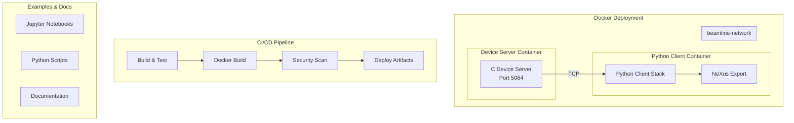

# M5 Integration - Detailed Implementation Plan

## Overview

Complete the integration stage by implementing NeXus/HDF5 data export, Docker containerization, enhanced CI/CD pipelines, comprehensive examples, and documentation. This milestone makes the project production-ready and deployable.

## Architecture



## Module Structure

```
beamline-simulator/
├── docker/
│   ├── Dockerfile.device      # C device server container
│   ├── Dockerfile.python      # Python client container
│   ├── docker-compose.yml     # Multi-service orchestration
│   ├── .dockerignore.device   # Device build exclusions
│   └── .dockerignore.python   # Python build exclusions
├── python/beamline/daq/
│   └── nexus.py               # NeXus/HDF5 export module
├── examples/
│   ├── notebooks/
│   │   ├── 01_xrd_analysis.ipynb
│   │   ├── 02_xafs_analysis.ipynb
│   │   └── 03_integration_workflow.ipynb
│   ├── 01_basic_scan.py
│   ├── 03_mesh_scan.py
│   ├── 04_xafs_scan.py
│   └── 05_nexus_export.py
├── docs/
│   ├── architecture.md
│   ├── api.md
│   └── nexus_format.md
└── .github/workflows/
    └── ci.yml                 # Enhanced CI/CD
```

## 2026 Best Practices

### NeXus/HDF5 Export

- Use `h5py` 3.10+ with context managers (`with` statement)
- Follow NXxas application definition structure
- Implement gzip compression (level 1) for datasets
- Use chunked storage for large datasets (>10k points)
- Store metadata as HDF5 attributes with proper types
- Validate NeXus structure (optional: pynxtools for validation)

### Docker Containerization

- Multi-stage builds: separate build and runtime stages
- Non-root users: create `beamline` user (UID 1000) for security
- Minimal base images: `alpine:3.21` for C, `python:3.14-slim` for Python
- Health checks: TCP connectivity for device server, HTTP/command for Python
- `.dockerignore` files: exclude build artifacts, tests, .git
- Security scanning: Trivy integration in CI/CD

### CI/CD Pipeline

- Matrix testing: Python 3.12, 3.13, 3.14 on ubuntu-latest
- Parallel execution: independent jobs run concurrently
- Docker layer caching: optimize build times
- Security scanning: Trivy for vulnerability detection
- Artifact storage: GitHub Container Registry (ghcr.io)
- Coverage reporting: Codecov or GitHub Actions annotations

### Documentation

- Markdown format with code examples
- Type hints as inline documentation
- Jupyter notebooks for interactive tutorials
- API documentation: auto-generated from docstrings (optional)

## Phase 5.1: NeXus/HDF5 Export

### File: `python/beamline/daq/nexus.py`

### NeXusWriter Class

```python
class NeXusWriter:
    """NeXus/HDF5 file writer following NXxas application definition.

    Creates HDF5 files compliant with NeXus standard for X-ray
    absorption spectroscopy (XAS) data storage.
    """

    def __init__(
        self,
        filename: str | Path,
        mode: Literal["w", "w-", "a"] = "w",
        compression: int = 1,
    ) -> None:
        """Initialize NeXus file.

        Args:
            filename: Output HDF5 file path
            mode: File mode ('w' overwrite, 'w-' fail if exists, 'a' append)
            compression: Gzip compression level (0-9, default 1)
        """

    def write_scan(
        self,
        scan_data: ScanData,
        title: str | None = None,
        scan_type: Literal["linear", "mesh", "xafs"] = "linear",
    ) -> None:
        """Write scan data to NeXus format.

        Creates NXxas-compliant structure:
        /entry (NXentry)
          /title
          /start_time (ISO 8601)
          /definition = "NXxas"
          /instrument (NXinstrument)
            /source (NXsource)
              /current (ring current from metadata)
            /monochromator (NXmonochromator)
              /energy (array, eV)
            /detector (NXdetector)
              /data (array)
          /sample (NXsample)
            /name
            /position_x, /position_y
          /data (NXdata)
            @signal = "intensity"
            @axes = ["energy"] or ["two_theta"]
        """

    def add_metadata(self, key: str, value: Any) -> None:
        """Add custom metadata to /entry group.

        Args:
            key: Metadata key (will be sanitized)
            value: Metadata value (must be HDF5-serializable)
        """

    def close(self) -> None:
        """Close HDF5 file."""

    def __enter__(self) -> NeXusWriter:
        """Context manager entry."""

    def __exit__(self, *args: object) -> None:
        """Context manager exit."""
```

### ScanData Extension

Add method to `ScanData` class in `data.py`:

```python
def to_nexus(
    self,
    path: Path | str,
    title: str | None = None,
    scan_type: Literal["linear", "mesh", "xafs"] = "linear",
) -> None:
    """Export scan data to NeXus/HDF5 format.

    Args:
        path: Output file path
        title: Scan title (default: from metadata or auto-generated)
        scan_type: Scan type for proper axis labeling
    """
```

**Implementation Details:**

- Use `h5py.File` with context manager
- Create groups: `create_group("/entry/instrument/source")`
- Create datasets: `create_dataset("data", data=array, compression="gzip", compression_opts=level)`
- Set attributes: `group.attrs["NX_class"] = "NXentry"`
- Handle timestamps: convert to ISO 8601 string
- Energy axis: use motor position if XAFS scan, two_theta if XRD
- Default signal: first detector in detector_readings
- Compression: gzip level 1 (balance size/speed)

### Testing Strategy

```python
def test_nexus_writer_basic():
    """Test basic NeXus file creation."""

def test_nexus_structure_validation():
    """Test NXxas structure compliance."""

def test_nexus_metadata():
    """Test custom metadata addition."""

def test_nexus_roundtrip():
    """Test write → read → validate."""

def test_nexus_compression():
    """Test gzip compression."""

def test_nexus_large_dataset():
    """Test with 100k+ points (chunking)."""
```

## Phase 5.2: Docker Containerization

### File: `docker/Dockerfile.device`

```dockerfile
# Build stage
FROM alpine:3.21 AS builder

RUN apk add --no-cache \
    gcc \
    musl-dev \
    meson \
    ninja \
    cmocka-dev

WORKDIR /build
COPY device/ /build/

RUN meson setup build -Dc_std=c2x --buildtype=release && \
    meson compile -C build

# Runtime stage
FROM alpine:3.21

RUN addgroup -g 1000 beamline && \
    adduser -D -u 1000 -G beamline beamline

COPY --from=builder /build/build/beamline-sim /usr/local/bin/beamline-sim

USER beamline

EXPOSE 5064

HEALTHCHECK --interval=30s --timeout=3s --start-period=5s --retries=3 \
    CMD nc -z localhost 5064 || exit 1

CMD ["beamline-sim"]
```

### File: `docker/Dockerfile.python`

```dockerfile
# Build stage
FROM python:3.14-slim AS builder

RUN pip install --no-cache-dir uv

WORKDIR /build
COPY python/ /build/

RUN uv sync --frozen

# Runtime stage
FROM python:3.14-slim

RUN groupadd -r -g 1000 beamline && \
    useradd -r -u 1000 -g beamline beamline && \
    mkdir -p /app /data && \
    chown -R beamline:beamline /app /data

COPY --from=builder /build/.venv /app/.venv
COPY --from=builder /build/beamline /app/beamline

ENV PATH="/app/.venv/bin:$PATH"
ENV PYTHONUNBUFFERED=1

WORKDIR /app
USER beamline

VOLUME ["/data"]

HEALTHCHECK --interval=30s --timeout=3s --start-period=5s --retries=3 \
    CMD python -c "import beamline; print('OK')" || exit 1

CMD ["python", "-m", "beamline"]
```

### File: `docker/docker-compose.yml`

```yaml
version: "3.8"

services:
  device-server:
    build:
      context: ..
      dockerfile: docker/Dockerfile.device
    image: beamline-simulator/device-server:latest
    container_name: beamline-device
    ports:
      - "5064:5064"
    networks:
      - beamline-network
    healthcheck:
      test: ["CMD", "nc", "-z", "localhost", "5064"]
      interval: 30s
      timeout: 3s
      retries: 3
      start_period: 5s
    restart: unless-stopped

  python-client:
    build:
      context: ..
      dockerfile: docker/Dockerfile.python
    image: beamline-simulator/python-client:latest
    container_name: beamline-python
    depends_on:
      device-server:
        condition: service_healthy
    networks:
      - beamline-network
    volumes:
      - ../example_outputs:/data
    environment:
      - DEVICE_HOST=device-server
      - DEVICE_PORT=5064
    command: python -m beamline.daq.examples.basic_scan
    restart: "no"

networks:
  beamline-network:
    driver: bridge
```

### File: `docker/.dockerignore.device`

```
build/
.git/
*.o
*.a
tests/
.cursor/
```

### File: `docker/.dockerignore.python`

```
__pycache__/
.pytest_cache/
*.pyc
*.pyo
.venv/
tests/
.cursor/
example_outputs/
```

## Phase 5.3: CI/CD Enhancements

### File: `.github/workflows/ci.yml` (Enhanced)

Add matrix testing and Docker jobs:

```yaml
jobs:
  python-matrix:
    name: Python ${{ matrix.python-version }}
    runs-on: ubuntu-latest
    strategy:
      matrix:
        python-version: ["3.12", "3.13", "3.14"]

  docker-build:
    name: Docker Build
    runs-on: ubuntu-latest
    steps:
      - Build device image
      - Build Python image
      - Push to ghcr.io (on main branch)

  docker-test:
    name: Docker Integration Test
    runs-on: ubuntu-latest
    needs: docker-build
    steps:
      - docker-compose up
      - Run integration tests
      - docker-compose down

  security-scan:
    name: Security Scan
    runs-on: ubuntu-latest
    steps:
      - Trivy scan device image
      - Trivy scan Python image
      - Fail on high/critical vulnerabilities
```

**Implementation Details:**

- Matrix: Python 3.12, 3.13, 3.14 on ubuntu-latest
- Docker build: cache layers, use BuildKit
- Security: Trivy scanning with fail-on-high
- Artifacts: Upload test results, coverage reports
- Coverage: Minimum 80% threshold

## Phase 5.4: Examples & Documentation

### Jupyter Notebooks

**File: `examples/notebooks/01_xrd_analysis.ipynb`**

- Load scan data from CSV
- Find peaks using XRDAnalyzer
- Fit peaks (Gaussian/Lorentzian)
- Calculate d-spacing
- Visualize with matplotlib

**File: `examples/notebooks/02_xafs_analysis.ipynb`**

- Load XAFS scan data
- Find edge (E₀)
- Normalize spectrum
- Extract chi(k)
- Fourier transform to R-space
- Visualize with matplotlib

**File: `examples/notebooks/03_integration_workflow.ipynb`**

- Full workflow: scan → export → analysis
- NeXus file creation
- Data validation
- Analysis pipeline

### Python Script Examples

**File: `examples/05_nexus_export.py`**

```python
"""Example: Export scan data to NeXus format."""

from beamline.daq import DeviceClient, LinearScanConfig, ScanEngine
from beamline.daq.nexus import NeXusWriter

# Run scan
# Export to NeXus
with NeXusWriter("scan_001.nxs") as writer:
    writer.write_scan(data, title="XRD Scan 001", scan_type="linear")
    writer.add_metadata("sample_name", "Si powder")
```

### Documentation Updates

**File: `README.md`**

- Quick start with Docker
- Architecture diagram
- API overview
- Examples section
- Contributing guidelines

**File: `docs/nexus_format.md`**

- NeXus structure documentation
- NXxas application definition
- Usage examples

## Phase 5.5: Integration & Polish

### End-to-End Tests

- Full workflow: device start → scan → NeXus export → analysis
- Docker compose integration tests
- NeXus file validation
- Performance benchmarks

### Final Checklist

- [ ] All tests pass (unit, integration, e2e)
- [ ] Docker images build successfully
- [ ] Security scans pass (no high/critical)
- [ ] Documentation complete
- [ ] Examples run successfully
- [ ] CI/CD pipeline green
- [ ] Coverage ≥ 80%

## Dependencies

### Python Packages

Already in `pyproject.toml`:

- `h5py>=3.10.0` (NeXus export)

Optional for validation:

- `pynxtools` (dev dependency, NeXus validation)

### Docker Tools

- `docker` 24.0+
- `docker-compose` 2.20+
- `trivy` (security scanning)

## Implementation Checklist

- [ ] Phase 5.1: NeXus/HDF5 Export

  - [ ] NeXusWriter class implementation
  - [ ] ScanData.to_nexus() method
  - [ ] NXxas structure compliance
  - [ ] Compression and chunking
  - [ ] Unit tests
  - [ ] Integration tests

- [ ] Phase 5.2: Docker Containerization

  - [ ] Dockerfile.device (multi-stage)
  - [ ] Dockerfile.python (multi-stage)
  - [ ] docker-compose.yml
  - [ ] .dockerignore files
  - [ ] Health checks
  - [ ] Non-root users
  - [ ] Build and test locally

- [ ] Phase 5.3: CI/CD Enhancements

  - [ ] Matrix testing (Python versions)
  - [ ] Docker build jobs
  - [ ] Security scanning (Trivy)
  - [ ] Coverage reporting
  - [ ] Artifact storage

- [ ] Phase 5.4: Examples & Documentation

  - [ ] Jupyter notebooks (3 notebooks)
  - [ ] Python script examples
  - [ ] README updates
  - [ ] Documentation files

- [ ] Phase 5.5: Integration & Polish
  - [ ] End-to-end tests
  - [ ] Performance optimization
  - [ ] Final documentation review
  - [ ] Release preparation
